# clogem-press — Design Proposal (v2.1)

**A vdoing-class knowledge base + blog + docs generator for the Clojure ecosystem, with a babashka CLI.**

> Research and design proposal. **v1 August 2026** (initial proposal); **v2 August 2026**;
> **v2.1 August 2026** (this revision — an independent verification pass; see the
> [v2.1 changelog](#111-v21-changelog-verification-pass)). Reimplements the functionality of
> [vuepress-theme-vdoing](https://github.com/xugaoyi/vuepress-theme-vdoing) on a Clojure/babashka
> stack.
>
> **v2 changed four things structurally** — see the [v2 changelog](#11-v2-changelog) for the full
> list and the reasoning:
> 1. **Repo split.** `clogem-press` becomes a pure open-source generator (bb library + default theme
>    + `examples/` demo site + user docs). All real content moves to `EchoJustus.github.io`.
> 2. **Deployment.** The cross-repo deploy-key push into `main:/docs` is replaced by GitHub's
>    Pages **artifact flow** (`upload-pages-artifact` + `deploy-pages`) running *inside*
>    `EchoJustus.github.io`, with Pages source set to "GitHub Actions". No built HTML is ever
>    committed anywhere, so build-trigger loops are structurally impossible.
> 3. **Internationalization** moves out of "deferred" and into the plan: primary content language
>    **English**, UI switchable across **en / zh-Hans / zh-Hant / ms / ta**, with per-article
>    language versions sharing one identity.
> 4. **China-oriented tooling removed** (Baidu push + cron, Baidu tongji, `baidu-autopush`,
>    iconfont.cn, the unimplemented twikoo/waline/artalk providers), replaced by sitemap +
>    Search Console/Bing, an optional IndexNow task, and a config-driven analytics slot (§6.10).
>
> Every library version, maintenance date, and compatibility claim was verified against primary
> sources (GitHub, Clojars, npm/PyPI registries, vendor docs) in August 2026, and the load-bearing
> claims were **verified empirically** by running code under babashka v1.13.219 (see
> [Appendix A](#appendix-a--empirically-validated-claims)). v2's new claims — action versions, the
> `GITHUB_TOKEN` trigger contract, Pagefind's multilingual internals, hreflang rules — are verified
> in [research/12](research/12-i18n-multilingual.md) and
> [research/13](research/13-pages-actions-deploy.md), several of them **against source code** where
> the vendor documentation was silent or wrong.

---

## Executive summary

**Recommendation: build clogem-press from scratch as a babashka-native generator.** Do not build on
Cryogen, quickblog, Eden, or Fabricate — the survey shows none can satisfy both halves of the
requirement (vdoing's content model + a babashka CLI). The good news is that babashka itself now
bundles almost the entire needed stack: markdown parsing (nextjournal/markdown, with a walkable AST),
Hiccup, Selmer, YAML, http-kit (dev server with SSE live reload), JSON, and XML (RSS/sitemap) are
**all built in, with zero dependencies to resolve**. The parts babashka can't do (full-text search
with CJK support, syntax highlighting) are covered by two well-maintained standalone static binaries
— Pagefind and Chroma — invoked from bb tasks, keeping the whole toolchain Node-free.

The essence of vdoing is not Vue — it is a set of *content conventions* (numbered directories →
auto-generated sidebar, auto front matter with stable random permalinks, category/tag/archive index
pages, catalogue pages) plus a CSS-variables theme with four color modes. Both halves reimplement
cleanly as pure data transforms over a page map, which is exactly the shape the healthiest corner of
the Clojure SSG ecosystem (stasis, quickblog, babashka.org) already uses.

**What v2 adds to that thesis.** vdoing has no multilingual story at all, and the requirement here is
a Singapore-context site: English-primary, with per-article versions in Simplified Chinese,
Traditional Chinese, Malay, and Tamil. The design meets it with one idea — **an article's identity is
its permalink, and every language version shares it**. That single rule makes the sidebar show one
entry, the indexes list one row, giscus host one discussion thread, and hreflang generate a correct
bidirectional set, all without a second identity field. It also survives the awkward case the
requirement explicitly allows: an article with no English version at all.

And because the identity lives *inside the file* (vdoing's own trick), file moves still don't break
URLs — which turns out to be the deciding argument in the permalink-assignment analysis (§7.2), where
the owner's habit of committing Markdown through the GitHub web UI forces the auto-fill step into CI.

| | |
|---|---|
| **Foundation** | From scratch on bb built-ins (stasis-style page map; ~0 framework deps) |
| **Markdown** | nextjournal/markdown 0.7.225 (built into bb) + clj-yaml front matter |
| **Templating** | Hiccup (built into bb), data-driven theme |
| **Styling** | Plain CSS custom properties; optional garden palette layer |
| **Search** | Pagefind ≥1.5.2 `extended` binary (segments `zh-Hans` *and* `zh-Hant`; Tamil stemming) |
| **Highlighting** | Chroma v2 binary at build time, CSS-variable dual themes |
| **Comments** | giscus (GitHub Discussions), one thread per article identity across languages |
| **i18n** | en / zh-Hans / zh-Hant / ms / ta; filename-suffix variants; `/lang/`-prefixed URLs |
| **Dev server** | bb built-in http-kit (+ a small static-file handler) + SSE reload + fswatcher pod (polling fallback) |
| **Deploy** | GitHub Pages **artifact flow** inside `EchoJustus.github.io`; generator checked out at a pinned tag; no credentials, no committed HTML |

---

## 1. What vuepress-theme-vdoing actually is (feature summary)

vdoing (~4.9k stars, MIT, latest v1.12.9) describes itself as a knowledge-management tool for
programmers built on **three knowledge forms**: structured (a folder tree rendered as a book-like
knowledge base with auto-generated sidebar, catalogue pages, breadcrumbs), fragmented (a `_posts/`
blog with lists, categories, tags, archive), and systematic (multi-dimensional indexing so every
knowledge point is reachable via category page, tag page, archive, catalogue, and search). Its **four
usage modes** (KB+blog, blog-only, KB-only, docs site) are not a switch — they emerge from which
conventions a site uses.

### 1.1 The content conventions (the real "API" to replicate)

These were verified against vdoing's source (`getSidebarData.js`, `setFrontmatter.js`,
`handlePage.js`):

- **Numbered directory convention.** `docs/01.前端/25.JavaScript/01.article.md`. Number prefixes are
  optional at level 1, required at levels 2–3; level 4 is files only. Numbers need not be consecutive
  (gaps like 10/20/30 recommended). The number is parsed as `parseInt` before the first `.`; the
  title is the segment between the first and last `.` for files, and everything after the first `.`
  for directories (front matter `title` overrides). Duplicate numbers at a level overwrite each other
  with a warning; invalid numbers cause the entry to be skipped with a warning. Excluded from
  scanning: `.vuepress/`, `@pages/`, `_posts/`, files directly under `docs/`.
  **v2 amends this rule** to recognize a language suffix — see §6.1.
- **Auto front matter.** On every build, missing keys are written *into the source files* (never
  overwriting manual values): `title` (from filename), `date` (file birthtime), `permalink`
  (`/pages/` + 6 random hex chars + `/` — **no collision check in vdoing**; older versions emitted 16
  chars, so permalinks must be treated as opaque), `categories` (from the directory path with number
  prefixes stripped), `tags` (empty placeholder), plus arbitrary `extendFrontmatter` defaults.
- **Two-path routing model.** Every page has a *regular path* derived from its file location and a
  *permalink* (`permalink` front matter wins over everything). Sidebar structure is matched against
  the regular path; links target the permalink. This is what makes file moves/renames URL-stable —
  and permalink stability is load-bearing (vdoing's gitalk comment identity is
  `permalink.slice(-16)`). **In v2 the permalink additionally carries article identity across
  language versions** (§6.2).
- **`_posts/`** — fragmented blog posts: no numbering, no structured sidebar (`sidebar: auto`
  injected), category from subfolder or `categoryText` default, sorted by date.
- **`@pages/`** — three auto-created index pages (`categoriesPage.md`, `tagsPage.md`,
  `archivesPage.md`) with flag front matter (`categoriesPage: true` etc.), rendered as filterable
  category/tag bars + paginated lists and a year/month-grouped archive.
- **Catalogue pages (目录页).** Front matter `pageComponent: {name: Catalogue, data: {path, imgUrl,
  description}}` renders a card-grid outline of one directory subtree *instead of* the markdown body;
  depends on the structured sidebar data; conventionally combined with `article: false, sidebar:
  false, comment: false`.
- **"Is this an article?" predicate** (drives every list/index):
  `not (pageComponent || article == false || home == true)`.
- **Front matter vocabulary** (recognized keys): `title date permalink categories tags titleTag
  sticky article comment editLink author sidebar sidebarDepth navbar pageClass prev next search
  pageComponent home` + homepage keys (`heroImage bannerBg features postList simplePostListLength
  hideRightBar`) + index-page flags. **v2 adds one key, `lang`** (§6.1).

### 1.2 Theme features

- **Four color modes** — `defaultMode: auto | light | dark | read`. Verified from `palette.styl`:
  modes are body classes (`.theme-mode-light/dark/read`) that swap ~10 CSS custom properties
  (`--bodyBg`, `--mainBg`, `--sidebarBg`, `--textColor`, `--codeBg`, …). "Auto" is JS choosing a
  class. **Nothing about vdoing theming requires a preprocessor** — Stylus is a VuePress-1 legacy.
- **Two page styles** — `pageStyle: card | line`, also body classes (`.theme-style-card/line`).
- **Blog identity** — blogger profile card (avatar/name/slogan), social icons, footer, "recent
  updates" bar, sticky posts, detailed/simple/none homepage post list with pagination,
  banner/background images with opacity and rotation, content background patterns, animated title
  badges.
- **htmlModules** — raw HTML injected into 9 named regions (sidebar top/bottom, page top/bottom,
  fixed windows, homepage sidebar) — vdoing's "no-code" extension story.
- **Article page** — breadcrumbs, author/date/category/tag info line, right-hand TOC bar with scroll
  spy, prev/next buttons, edit link, comment slot.
- **Markdown extensions** — containers (exact source-verified set: `note tip warning danger right
  theorem details center`), YAML-driven `cardList`/`cardImgList` card grids, code copy button, line
  numbers, image zoom; demo-site plugins add `tabs` and `demo-block`.
- **Search** — bundled title-suggestion search; officially recommended full-text plugin; Algolia
  DocSearch support.
- **Comments** — not built in; per-page `comment: false` toggle + plugin embeds (vssue, gitalk,
  valine, waline, twikoo, artalk).
- **SEO / China tooling** — sitemap plugin, Baidu analytics (`baidu-tongji`), Baidu URL push
  (`baiduPush` npm script collecting `domain + permalink` into `urls.txt` and curling Baidu's push
  API, plus a daily GitHub Actions cron and a browser-side `baidu-autopush` plugin), and
  `social.iconfontCssFile` pointing at iconfont.cn.
  **v2 drops all of these** — see [§6.10 China-oriented features removed](#610-china-oriented-features-removed).
- **i18n — vdoing has none.** VuePress 1 has a `locales` mechanism, but vdoing's own conventions
  (sidebar generation, front-matter auto-fill, catalogue pages) are single-language throughout. §6 is
  therefore net-new design, not a port.

### 1.3 Maintenance status — why a reimplementation is timely

vdoing is **effectively frozen**: built on VuePress 1.x (Vue 2 / webpack 4, requires
`NODE_OPTIONS=--openssl-legacy-provider` on modern Node), last feature release v1.12.9 (Aug 2023),
2024–2025 commits are content-only, ~87 open issues, no VuePress 2 port. VuePress 1.x itself is
end-of-life. The conventions are excellent; the runtime is dead weight. That is precisely the
clogem-press opportunity.

---

## 2. Clojure ecosystem survey results

### 2.1 Static site generators

| Project | Status (verified Aug 2026) | bb-compatible? | Verdict for clogem-press |
|---|---|---|---|
| **Cryogen** | ✅ Active (core 0.5.1, Jun 2026) | ❌ No — flexmark (Java), enlive DOM core, asciidoctorj | Best-engineered JVM blog engine; its hooks could host a vdoing-shaped site, but you'd write all distinguishing features yourself *and* lose the bb CLI. **Architecture donor** (Markup protocol, EDN config deep-merge, clean-urls tri-mode, incremental changeset compile). |
| **quickblog** | ✅ Active (v0.4.7 Jun 2025; commits Aug 2026) | ✅ Yes — bb-first | Flat blog only: non-recursive glob, no tree/sidebar/categories/search/TOC. **Design-pattern donor** (CLI spec pattern, watch-mode architecture, template override story, frontmatter reader). Not a fork base — the gap is the content model itself. |
| **stasis** | ✅ Stable-by-design ("finished"; 2023 release updated deps *for bb*) | ✅ Yes, deliberately | "A site is a map from URL paths to page fns" — the right substrate. Tiny (one namespace, vendorable). **Foundation candidate.** |
| **powerpack** | ✅ Active (2025.10.22) | ❌ No — Datomic peer | Content-as-Datomic-database is genuinely attractive for multi-dimensional indexing, but irreducibly JVM. Fallback if bb requirement were dropped. |
| **Eden** (anteoas) | ⚠️ Dormant since 2025-09; 2 stars, bus factor 1 | ❌ No — Jetty, imgscalr, browser-sync via npx | Feature-adjacent and, for v2, **the best Clojure-side i18n reference there is** (per-language render pass, `strings.edn` maps, `:eden/t` with `{{var}}` interpolation) — but reachability-based rendering *inverts* KB assumptions (orphan notes silently unbuilt). **Design reference only.** |
| **Fabricate** | ⚠️ Solo, active 2026, pre-1.0 | ❌ No — instaparse, JVM eval core | Clojure-in-prose authoring is the inverse of vdoing's plain-markdown ergonomics; markdown support still "planned". **Architecture reference** (entry maps, multimethod pipeline seams). |
| Perun | ❌ Dead (substantive commits ended 2020; Boot itself moribund) | ❌ | Pipeline ideas only. |
| Toto (metasoarous) | ❌ Dead (alpha, idle since Jan 2021) | ❌ | — |
| Hardly | ❌ Personal project, 8 commits, 0 stars | ✅ | Existence proof that a bb+Selmer pipeline is a handful of tasks. |
| bootleg | ❌ Dormant since 2020 | ✅ (pod) | Superseded by bb built-ins. |
| misaki / incise / oz | ❌ Dead/archived (2014/2018/stalled) | ❌ | — |

**The decisive ecosystem fact:** babashka bundles the whole core stack. Verified by probing bb
v1.13.219 in this session: `hiccup2.core` ✅, `selmer.parser` ✅, `clj-yaml.core` ✅,
`org.httpkit.server` ✅ (including SSE/WebSocket channel APIs), `cheshire.core` ✅,
`clojure.data.xml` ✅, `babashka.cli/fs/pods/http-client` ✅ — and since bb 1.12.201,
`nextjournal.markdown` is compiled into the binary. A markdown→hiccup→HTML pipeline with a dev server
needs **zero dependencies**. (bb 1.13.219 is dated 2026-07-27 in the project CHANGELOG and remains
the latest release as of this revision.) Meanwhile clojure-lsp — a flagship Clojure project — builds
its docs with Python's MkDocs, whose upstream is now itself flagged as unmaintained: there is no
Clojure-native MkDocs/vdoing equivalent. clogem-press targets a real gap.

### 2.2 Markdown libraries (empirically tested under bb 1.13.219)

| Library | Runs under bb? | AST? | Front matter | Notes |
|---|---|---|---|---|
| **nextjournal/markdown 0.7.225** | ✅ **built in** | ✅ walkable maps, TOC + GitHub-style heading slugs pre-computed | ❌ (6-line splitter + built-in clj-yaml) | GFM verified: tables, task lists, strikethrough, autolinks; footnotes; LaTeX. Custom hiccup renderers per node type; custom text tokenizers (wikilink tokenizer ships in utils). Caveat: `:html-block`/`:html-inline` need a `hiccup2.core/raw` passthrough renderer (verified fix). |
| markdown-clj 1.12.9 | ✅ as dep | ❌ string→string | ✅ full YAML | Verified CommonMark violations: multi-paragraph list items split the list; multi-line link text unparsed; raw HTML mangled. Ugly URL-encoded heading anchors. Unsuitable as KB foundation. |
| cybermonday | ❌ (flexmark/Java — verified failure) | ✅ | ✅ | Dormant since 2024. |
| markdown2clj | ❌ (verified failure) | — | — | Abandoned (~2017). |
| flexmark interop | ❌ JVM only | ✅ | ✅ | Only relevant for a future JVM "power mode". |

### 2.3 Templating, styling, and supporting cast

- **Hiccup 2** (built in): HTML as Clojure data — composable, testable, no template files to escape.
  **Selmer** (built in): Django-style strings — better for user-editable templates.
- **Styling:** vdoing's theme is verifiably just CSS variables + body classes; plain CSS with custom
  properties and native nesting needs no build step. `com.lambdaisland/garden` (1.9.606, Dec 2025,
  explicitly bb-compatible) is the one credible CSS-in-EDN option, useful for the palette layer.
  dart-sass standalone binary is a viable fallback; Tailwind is the wrong shape for a semantic,
  variable-themeable theme; girouette is dormant.
- **Search:** **Pagefind 1.5.2** (Apr 2026, still current) — post-build Rust indexer over the HTML
  output; the `pagefind_extended` binary has first-class CJK segmentation. **v2 verified the details
  that matter for five languages against Pagefind's source** (§6.7): indexes split by lowercased
  `<html lang>`; segmentation triggers on the *primary subtag* `zh`/`ja`/`th`, so `zh-Hans` **and**
  `zh-Hant` are both segmented; Tamil gets a Snowball stemmer and UI translations; Malay gets neither
  but still indexes. Lunr is frozen (2020), Stork is wound down, MiniSearch/FlexSearch ship
  monolithic client-side indexes. Fallback: FlexSearch 0.8 with its CJK charset preset over a
  build-emitted JSON index.
- **Syntax highlighting:** **Chroma v2.27** (Jun 2026, single 8.4 MB Go binary, 200+ languages
  converted from Pygments incl. good Clojure) at build time — verified locally: clean class-based
  HTML with line numbers. Dual light/dark via two generated stylesheets merged into CSS variables.
  Shiki is better but hard-requires Node; Prism is in maintenance mode; highlight.js is the
  client-side fallback; clygments/glow are dormant and JVM-only.
- **Comments:** **giscus** (GitHub Discussions; 12k stars, active May 2026) is the only GitHub-backed
  option still maintained — vssue (what vdoing used) is dead (npm 2021), utterances frozen since
  2022, gitalk dormant with a client-side `clientSecret` design flaw. giscus: one script tag,
  `preferred_color_scheme` theme + runtime `postMessage` switching (hooks into our mode toggle), lazy
  loading, self-hostable. **v2 changes the mapping** from `pathname` to `specific` + `data-term` so
  all language versions of an article share one thread (§6.8); giscus's `data-lang` list was verified
  to include `en`/`zh-CN`/`zh-TW` but **not** `ms`/`ta`.
- **Dev server:** bb's built-in http-kit provides the server and **SSE push** (verified end-to-end in
  this session: `as-channel` + `send!` with `close-after-send? false`); `EventSource` auto-reconnects,
  beating quickblog's CDN-hosted live.js polling. Static file serving is *not* built in — it comes
  from either `org.babashka/http-server` 0.1.14 (whose `file-router` is technically private API) or a
  small vendored handler (~50 lines). File watching via the org.babashka/fswatcher pod 0.0.7
  (quickblog's proven choice) — with a **polling fallback** (`babashka.fs/modified-since` loop), which
  this session proved necessary: inotify events silently never fire in some sandboxed containers.
- **Deployment (v2, rewritten).** GitHub Pages' **"GitHub Actions" publishing source** replaces
  deploy-from-branch. The flow is `actions/checkout` → `actions/upload-pages-artifact` →
  `actions/deploy-pages`, deploying **only to the Pages site of the repo the workflow runs in** —
  which is exactly why the workflow moves into `EchoJustus.github.io` and why D-8's two halves (repo
  split, deployment change) are one decision. `GITHUB_TOKEN` with `pages: write` + `id-token: write`
  is the entire credential story; no deploy key, no PAT. `.nojekyll` is no longer needed (Jekyll only
  runs for the branch source). Verified bonus, from GitHub's docs source: "GitHub Pages sites have a
  _soft_ limit of 10 builds per hour. This limit does not apply if you build and publish your site
  with a custom GitHub Actions workflow." Constraints that do bind: published sites ≤ 1 GB,
  deployments time out at 10 minutes, and `upload-pages-artifact` excludes dotfiles unless
  `include-hidden-files: true`. The README's "only files and directories … no symbolic or hard links"
  wording describes the *tar's contents*, not a restriction on `dist/`: the action tars with
  `--dereference --hard-dereference`, so links are materialized into real files on the way in — see
  §7.1. Pages responses remain `cache-control: max-age=600` (not
  configurable) — asset fingerprinting still recommended. Full detail and version table:
  [research/13](research/13-pages-actions-deploy.md).

---

## 3. Comparison matrix: Vue/JS vs Clojure ecosystem

| Dimension | VuePress + vdoing | clogem-press (proposed) | Assessment |
|---|---|---|---|
| Core framework | VuePress 1.x (EOL, Vue 2, webpack 4) | From-scratch bb generator (stasis-style page map) | Clojure side is *smaller and healthier*: the "framework" is the babashka distribution itself (4.6k stars, released 2026-07-27) |
| Templating | Vue SFCs + theme components | Hiccup functions (built in) | Hiccup ≈ JSX-for-Clojure; no client framework needed since output is static |
| Markdown | markdown-it + plugins | nextjournal/markdown AST (built in) | AST-first beats string pipelines for TOC/anchors/link rewriting; container/component syntax must be reimplemented (tokenizers/renderers) |
| Client interactivity | Vue 2 runtime (tens of KB of framework JS) hydrating everything | ~200 lines vanilla JS (mode toggle, sidebar, TOC scroll-spy, copy buttons, language switcher) + Pagefind UI | Static HTML + progressive enhancement; faster pages, no hydration |
| Build tool | webpack 4 (+ openssl-legacy hacks) | bb tasks | Seconds-fast startup, no node_modules |
| Styling | Stylus (legacy) | Plain CSS custom properties | vdoing's theming *is* CSS variables; preprocessor was incidental |
| Search | @vuepress/plugin-search / fulltext plugin / Algolia | Pagefind extended | Pagefind's chunked lazy index beats the Vue plugins' in-bundle indexes at scale; per-language indexes come free from `<html lang>` |
| **i18n** | **none in vdoing** (VuePress `locales` exists but the theme's conventions are single-language) | 5 languages, per-article variants, one shared identity | Net-new capability, not a port. Prior art surveyed in [research/12](research/12-i18n-multilingual.md) |
| Syntax highlighting | Prism (build-time via VuePress) | Chroma (build-time via bb) | Equivalent model; Chroma actively maintained, Prism in maintenance mode |
| Comments | vssue (dead) / gitalk (dormant) | giscus, one thread per article identity | Clojure side strictly better today |
| Dev server | webpack-dev-server HMR | http-kit + SSE reload (built in) | Full HMR not replicated; page-reload-on-change is adequate for content authoring |
| Deployment | deploy.sh force-push to gh-pages | GitHub Pages artifact flow in the content repo | v2 is *simpler than both*: no branch of built HTML, no credential, no loop risk |
| Ecosystem risk | Dead upstream (VuePress 1) | bb built-ins + 2 pinned static binaries | Risk shifts from "dead framework" to "we own the code" — see §10 |

**What the Vue ecosystem still does better:** instant HMR with state preservation; a large
theme/plugin marketplace; Algolia DocSearch integration maturity. None are blockers for a personal
knowledge base, and none come from VuePress 1.x specifically (which is dead).

---

## 4. Technology stack recommendation

| Component | Recommendation | Justification |
|---|---|---|
| Static site generation | **From-scratch bb-native core** (stasis-style `{uri → page-fn}` map; optionally vendor stasis's export fns) | Only path satisfying both vdoing's content model and the bb CLI (§2.1). Foundation risk ≈ babashka itself. |
| Markdown parsing | **nextjournal/markdown** (bundled 0.7.225) | Zero-dep, AST + pre-computed TOC/slugs, custom tokenizers (wikilinks!) and per-node renderers; verified GFM. |
| Front matter | **clj-yaml** (built in) + regex splitter | vdoing content is YAML front matter; verified splitter pattern. EDN front matter also accepted (Clojure-native bonus, quickblog precedent). |
| HTML templating | **Hiccup 2** (built in) for the theme; Selmer reserved for user-facing snippet templates if needed | Theme = data transforms; Hiccup composes (sidebar tree recursion is a plain recursive fn — famously impossible in Selmer). |
| Styling | **Plain CSS custom properties** (+ optional lambdaisland/garden for the palette layer only) | vdoing's theming is literally CSS variables + body classes; zero build step; EDN palette → generated `.theme-mode-*` blocks if garden adopted, degrading gracefully to checked-in CSS. |
| Task runner / CLI | **Babashka** — bb.edn tasks + babashka.cli using quickblog's ns-metadata spec pattern | Required; the spec pattern gives CLI parsing + grouped help + programmatic defaults from one definition. |
| Search | **Pagefind ≥1.5.2 extended** binary, post-build; fallback FlexSearch+CJK | Only option that is Node-free, CJK-capable, sub-linear in client bandwidth, with a themable dark-mode UI, **and multilingual with zero config** (§6.7). |
| **i18n** | **Filename-suffix variants + identity-by-permalink + EDN string maps**; per-language render pass | Suffix convention is the convergent answer across Hugo / mkdocs-static-i18n; identity-by-permalink reuses a field clogem-press already collision-checks and already uses for comment identity ([research/12](research/12-i18n-multilingual.md) §1, §7). |
| Comments | **giscus**, behind `:comments {:provider …}` config (`:none` default), `mapping :permalink` | Only maintained GitHub-backed system; available from Singapore; runtime theme switching hooks into our mode toggle; one thread per article across languages. |
| Syntax highlighting | **Chroma v2** binary during render, content-hash cached; fallback highlight.js client-side | Node-free, active, Pygments-quality Clojure lexer, line numbers built in. Verified locally. |
| Dev server | **http-kit** (built in) for serving + SSE `/__reload`; static files via a small vendored handler (or org.babashka/http-server); **fswatcher pod** with `--poll` fallback | SSE reload verified end-to-end in this session — as was the container where inotify is broken (hence the fallback). |
| Deployment | **GitHub Pages artifact flow** (`upload-pages-artifact` + `deploy-pages`) in a workflow living in `EchoJustus.github.io`, checking out the generator at a pinned tag | No credential to manage, no committed HTML, no build-loop, and the 10-builds/hour Pages limit stops applying. Verified in [research/13](research/13-pages-actions-deploy.md). |
| RSS / sitemap | **clojure.data.xml** (built in) | Atom feed (one per language) + sitemap.xml with `xhtml:link` hreflang alternates are small pure functions over the page map. |
| Analytics (optional) | **Config slot**: `:none` (default) \| GA4 \| Plausible \| Umami | Replaces vdoing's Baidu tongji. All are a single script tag; Plausible/Umami are self-hostable and privacy-first. |

### Binary-tool policy

Pagefind and Chroma follow one shared pattern: pinned version + checksum in config, a `fetch-tool` bb
helper downloading the right platform artifact into `.cache/tools/` on first use, invoked via
`babashka.process`. CI runs them with no setup (musl static binaries, verified on a plain Linux
container). Neither touches the content pipeline: Chroma transforms code blocks during render;
Pagefind post-processes the finished HTML directory. If either disappeared, the replacement cost is
one function. **v2 note (amended in v2.1):** the tool cache must live *outside* the published output
directory, because every byte in it counts against the 1 GB site limit — a ~58 MB Pagefind binary
symlinked into `dist/` would be **dereferenced into the artifact as 58 real megabytes**, not skipped.
Symlinks themselves are not forbidden (§7.1); shipping their targets by accident is the actual hazard.

---

## 5. Architecture design

### 5.1 Repository layout (v2: two repos with a clean seam)

**D-8 resolved: split now.** `clogem-press` is a pure open-source generator; all content lives in
`EchoJustus.github.io`. The seam is a **pinned git ref**: the content repo's workflow checks out the
generator at a tag (or sha) and runs it against local content. Because `clogem-press` is public, the
checkout needs **no credentials** — verified from `actions/checkout`'s README, which requires a token
only "If your secondary repository is private or internal".

#### `clogem-press` — the generator (EPL-2.0)

```
clogem-press/
├── bb.edn                     ; tasks: build, dev, serve, clean, doctor, fm-fix, test, new,
│                              ;        edit-fm, migrate, theme, indexnow
│                              ;        (`serve` = static preview of an existing dist/, §7.4)
├── config.example.edn         ; annotated reference config (the schema, documented)
├── src/clogem/
│   ├── version.edn            ; the generator's own version, asserted against :generator
│   │                          ;   :min-version from site.edn (D-14)
│   ├── cli.clj                ; babashka.cli dispatch (quickblog spec pattern)
│   ├── config.clj             ; load + validate + deep-merge (theme < site < CLI overrides)
│   ├── scan.clj               ; content tree scanner (numbered-dir + language-suffix convention)
│   ├── frontmatter.clj        ; YAML/EDN read + surgical auto-fill (write-if-missing)
│   ├── model.clj              ; page/site model: article predicate, identity groups, categories,
│   │                          ;   tags, sidebar tree, archives, permalink table (two-path model)
│   ├── i18n.clj               ; language registry, string maps + fallback chain, variant resolution
│   ├── markdown.clj           ; nextjournal/markdown wrapper: containers, wikilinks, heading
│   │                          ;   anchors, html passthrough, language-aware link rewriting
│   ├── highlight.clj          ; Chroma integration + content-hash cache
│   ├── render.clj             ; page-map assembly {uri → hiccup-fn} + HTML export
│   ├── theme/                 ; default theme (Hiccup fns + static assets)
│   │   ├── layout.clj  sidebar.clj  page.clj  home.clj  indexes.clj  catalogue.clj  langbar.clj
│   │   └── resources/
│   │       ├── css/*.css      ; incl. fonts.css (:lang() stacks)
│   │       ├── js/*.js        ; mode toggle, TOC spy, copy, language switcher
│   │       ├── icons/*.svg    ; vendored, currentColor
│   │       ├── i18n/{en,zh-Hans,zh-Hant,ms,ta}.edn   ; theme chrome strings
│   │       └── fonts/         ; optional subsetted Noto Sans Tamil woff2 (OFL-1.1)
│   ├── search.clj             ; Pagefind invocation (+ FlexSearch JSON fallback emitter)
│   ├── feed.clj               ; Atom/RSS per language + sitemap.xml with hreflang alternates
│   ├── seo.clj                ; canonical, hreflang set, og:locale, IndexNow payload
│   └── dev.clj                ; http-kit server, SSE reload, watch orchestration
├── examples/demo-site/        ; small multilingual demo exercising EVERY convention
│   ├── site.edn
│   ├── content/
│   │   ├── index.md                                  ; home: true
│   │   ├── 01.Guide/10.Basics/01.getting-started.md   ; en only
│   │   ├── 01.Guide/10.Basics/02.conventions.md
│   │   ├── 01.Guide/10.Basics/02.conventions.zh-Hans.md
│   │   ├── 01.Guide/10.Basics/02.conventions.zh-Hant.md
│   │   ├── 01.Guide/20.Advanced/01.catalogue-demo.ta.md   ; ta-only article (no en version)
│   │   ├── 02.Notes/10.Local/01.hawker-guide.ms.md
│   │   ├── 00.Catalogue/01.Guide.md                   ; pageComponent: Catalogue
│   │   ├── _posts/2026-08-01-hello.md
│   │   └── @pages/                                    ; auto-created
│   ├── assets/
│   └── i18n/                                          ; site-level string overrides
├── doc/                       ; user documentation — built BY clogem-press (dogfooding),
│                              ;   published to clogem-press's own project Pages at /clogem-press/
├── test/
│   ├── clogem/*_test.clj
│   └── fixtures/              ; golden files; 5-language fixture corpus from Phase 1
├── .github/workflows/ci.yml       ; tests + build examples/demo-site + build doc/
├── .github/workflows/pages.yml    ; publish doc/ to clogem-press's own Pages (same artifact flow)
├── .github/workflows/release.yml  ; tag → GitHub Release + moving major tag
├── CHANGELOG.md  README.md  LICENSE (EPL-2.0)
```

The `examples/demo-site` is not decoration: CI builds it on every commit, which makes it the
executable specification of the conventions, and it is deliberately multilingual and deliberately
includes an article with **no English version** so the priority-fallback path (§6.3) is exercised
continuously.

#### `EchoJustus.github.io` — content + publishing

```
EchoJustus.github.io/
├── site.edn                   ; site config incl. :generator {:repo … :min-version "0.3.0"}
│                              ;   (the version PIN itself lives in publish.yml's `ref:` — D-14)
├── content/                   ; the real knowledge base (vdoing docs/ equivalent)
│   ├── index.md
│   ├── 01.<Category>/10.<Sub>/01.<article>.md
│   ├── 01.<Category>/10.<Sub>/01.<article>.zh-Hans.md
│   ├── 00.Catalogue/…         ; catalogue pages
│   ├── _posts/                ; fragmented blog posts
│   └── @pages/                ; auto-generated index pages
├── assets/                    ; user static files, copied through
├── i18n/                      ; optional site-level UI string overrides per language
├── overrides/                 ; optional: extra CSS, ejected theme namespaces
├── permalinks.edn             ; committed registry: collisions + tombstones + read-only fallback
├── .github/workflows/publish.yml
└── LICENSE
```

**Deleted in the migration:** `docs/` and its "Hello, World" `docs/index.html`. Once the Pages source
is "GitHub Actions", the `docs/` folder has no special meaning, and leaving a stale hand-written page
in the repo is a trap for future-you.

### 5.2 Content pipeline

```mermaid
flowchart LR
    A[content/ tree] --> B[scan:\nnumbered-dir parse\n+ language suffix\n+ exclusions]
    B --> C[front matter:\nread + auto-fill\nmissing keys to disk]
    C --> D[site model:\npages, identity groups,\nsidebar tree, categories,\ntags, archives, permalinks]
    D --> E[markdown to AST:\ncontainers, wikilinks,\nanchors, link rewrite]
    E --> F[Chroma highlight\ncode blocks, cached]
    F --> G[Hiccup theme render\nper page per variant\nwith lang in context]
    G --> H[export to dist/:\nHTML + assets + feeds\n+ sitemap + hreflang]
    H --> I[Pagefind index\nover dist/\none index per html lang]
    I --> J[upload-pages-artifact\nthen deploy-pages]
```



Build phases in detail:

1. **Scan** (`scan.clj`) — walk `content/`, applying vdoing's exact rules **as amended in §6.1**:
   strip the extension, strip a recognized language suffix, then parse `NN.name` (number = before
   the first dot; title = everything after the first dot-segment, extension and any language suffix
   dropped, for files — so `05.a.b.c.md` is titled `a.b.c` — and everything after the first dot for
   directories), skip invalid numbers with a warning, **error on duplicate numbers that belong to
   different identities** — same number *and* same title in one directory is the language-variant
   case and is legal (§6.1, D-3) — exclude `_posts/`, `@pages/`, `index.md`, dotfiles.
   Produces a raw tree of `{:order :title :path :lang :children}`.
2. **Front matter** (`frontmatter.clj`) — for each `.md`: split `---` fences, parse with clj-yaml (EDN
   maps also accepted). Fill missing keys following vdoing's algorithm (title/date/permalink/
   categories/tags + `extend-frontmatter` defaults), **write back surgically** — insert only the
   missing lines into the existing front matter block rather than reserializing the whole map
   (vdoing's json2yaml round-trip mangles quoting; we avoid the class of bug entirely). Permalinks:
   `/pages/xxxxxx/` 6 hex chars **with a collision check** against the permalink table (vdoing has
   none). Never overwrite manual values. **New in v2:** when a file is a language variant of an
   existing identity group, its permalink is *copied from its siblings*, not generated (§6.2); and the
   resulting table is written to `permalinks.edn`. `--no-write` makes the build purely read-only — see
   §7.2 for how read-only builds get deterministic URLs without churning permalinks.
3. **Site model** (`model.clj`) — one immutable map, the heart of the design:
   ```clojure
   {:pages     {regular-path {:front-matter … :permalink … :lang … :title … :content-fn …}}
    :articles  {"/pages/a1b2c3/"                                 ; identity group, keyed by permalink
                {:primary :en                                    ; highest-priority available lang
                 :variants {:en page-ref :zh-Hans page-ref}
                 :categories ["Guide" "Basics"] :tags [] :date … :sticky nil}}
    :tree      {:kind :dir :children [{:kind :dir :name "01.Guide" :order 1 :title "Guide"
                                       :children [… {:kind :article :permalink "/pages/a1b2c3/"}]}]}
    :sidebar   {"01.Guide" <that subtree>}                        ; per top-dir trees, deduped
    :permalinks {"/pages/a1b2c3/" regular-path}                   ; two-path model
    :categories {"Guide" [article-id …]}                          ; ids, not pages
    :tags       {"tag1" [article-id …]}
    :archives   {2026 {8 [article-id …]}}
    :posts      [article-id …]                                    ; article predicate, newest first
    :sticky     [article-id …]                                    ; `sticky:` rank order (Phase 2)
    :catalogue  {"/01.Guide" "/pages/xyz/"}}                      ; breadcrumb links, keyed by dir-key
   ```
   The v2 shift is small but load-bearing: **`:categories`, `:tags`, `:archives`, `:posts` and the
   sidebar hold *article ids* (permalinks), not page refs.** Dedupe-by-identity therefore isn't a
   filter applied late in a template — it's the shape of the model, so it is impossible to get wrong
   in one index and right in another. Categories/tags/archives are **computed at build time** (vdoing
   computes them client-side in Vue — we ship plain HTML instead).
4. **Markdown** (`markdown.clj`) — nextjournal/markdown `parse` with custom text tokenizers
   (`[[wikilink]]` via the bundled tokenizer — a *bi-directional links* foundation vdoing never had)
   and a renderer map overriding: `:html-block`/`:html-inline` (raw passthrough — required, verified),
   `:heading` (anchor link using the pre-computed slug), `:link` (permalink rewriting: `.md`-relative
   and `/pages/…/` links resolved through the permalink table, **and resolved to the same-language
   variant when one exists** — see §6.3; dead links warn), `:code` (Chroma). vdoing's `::: tip`
   containers are parsed by a small block-level pre-pass (fence-matching, nestable) emitting custom
   node types with their own renderers; container *titles* come from the i18n string map so
   `::: tip` renders as "提示" on a zh-Hans page; `cardList` containers parse their YAML body with
   clj-yaml.
5. **Render + export** (`render.clj`, `theme/*`) — assemble `{uri → (fn [] hiccup)}` for every page
   variant + index page (per language) + catalogue + paginated lists, then export: `hiccup2.core/html`
   → `dist/` with clean URLs (`/pages/a1b2c3/index.html`, `/zh-Hans/pages/a1b2c3/index.html`), copy
   assets, emit per-language Atom feeds + sitemap with hreflang alternates (+ `CNAME` if configured).
   Full rebuild is the default correctness baseline; the page cache (§5.5) makes dev fast.
6. **Search** (`search.clj`) — run Pagefind extended over `dist/`; output lands in `dist/pagefind/`,
   automatically split into one index per `<html lang>` value.

### 5.3 Theme system

- **Layout** — three-column article layout (sidebar / content / TOC bar), navbar with dropdowns,
  breadcrumbs, article info line, prev/next, footer; card-grid homepage with banner, feature cards,
  paginated post list, blogger card, social icons. **v2 adds** a navbar language switcher and a
  per-article variant bar (§6.4).
- **Color modes** — vdoing-compatible body classes `.theme-mode-{light,dark,read}` +
  `.theme-style-{card,line}` swapping the documented CSS-variable palette. A synchronous inline
  `<head>` script (the VitePress pattern) reads localStorage → stamps the class before first paint (no
  FOUC); `auto` resolves via `prefers-color-scheme` and tracks OS changes live. `<meta
  name="color-scheme">` emitted. The toggle also `postMessage`s giscus and swaps the Chroma palette
  (both variable-driven, so usually free).
- **Customization ladder** (mirrors vdoing's, no code → all code):
  1. `site.edn` options (§5.6) — covers everything vdoing's `themeConfig` covers, plus `:langs`/`:i18n`;
  2. CSS variable overrides — user drops one CSS file in `overrides/` after the theme stylesheet;
  3. i18n string overrides — `i18n/<lang>.edn` in the content repo, deep-merged over theme defaults;
  4. `:html-modules` — raw HTML strings injected into the same 9 named regions vdoing defines (plus
     `:head-extra` for analytics/fonts);
  5. Template override — quickblog's copy-on-first-use story: `clogem theme eject sidebar` copies
     `theme/sidebar.clj` into `overrides/`, which then shadows the built-in (user code is loaded onto
     the bb classpath ahead of the library).
- **Icons** — vendored inline SVGs (sourced at dev time from Iconify/Tabler/Lucide), inheriting
  `currentColor` so they follow the mode automatically. **No iconfont.cn** (vdoing's
  `social.iconfontCssFile` default), and no third-party CDN of any kind.

### 5.4 Dev server (`bb dev`)

Single bb process, all built-ins (validated end-to-end this session):

```
bb dev
 ├─ full render → dist/ (dev variant injects SSE reload <script>; Cache-Control: no-cache)
 ├─ http-kit run-server (port 1888)
 │    ├─ GET /__reload → SSE channel (as-channel; clients atom; "retry: 500")
 │    └─ *             → static file handler over dist/
 ├─ fswatcher pod on content/ assets/ i18n/ overrides/ site.edn  {:recursive true}
 │    └─ events → debounce (drain-until-100ms-quiet) → filter editor temp files
 │         ├─ content change  → re-parse that file → update model → re-render that variant
 │         │                    + its identity siblings (hreflang/variant bar changed)
 │         │                    + affected structural pages (sidebar/indexes: cheap)
 │         ├─ i18n/config/theme change → full re-render
 │         └─ asset change → copy/delete
 └─ after each pass → send! "data: reload" to all SSE clients (data: css for CSS-only)
```

`--poll` flag switches watching to a `babashka.fs/modified-since` loop — **required in practice**:
this session demonstrated a container where fsnotify registers but never fires. `bb dev` detects such
environments and falls back to polling **automatically**, rather than suggesting a flag the user has
no way to know they need.

Detection has to be a *probe*, because whether events fire is a property of the container and not of
the pod: `load-pod` succeeds and `watch` returns a watcher id in exactly the environment that then
delivers nothing. So after registering, `bb dev` touches a temp file inside a watched directory and
waits for its event; on silence it unwatches and polls, saying which of the two happened. The probe's
own event is swallowed so startup does not rebuild twice, and registration is on the same clock as
delivery — `watch` is a synchronous call into a subprocess and has been observed to block
indefinitely, which hangs `bb dev` before it prints anything, a strictly worse failure than the one
the probe exists to catch. `--probe-ms` tunes the window, which is a single deadline shared by registration and delivery
rather than one each. Delivery is the cheap half — about 100 ms, because clogem-press passes the pod
an explicit `:delay-ms` equal to this section's own debounce instead of accepting its two-second
default; the budget is sized for registration, which intermittently never returns. See Appendix A
item 5 for the measurements.

The one i18n-specific subtlety: editing *one* variant invalidates *all* siblings, because the variant
bar and the hreflang set are shared. Re-rendering a whole identity group is still a handful of pages,
so the dev loop stays interactive.

### 5.5 Caching strategy

quickblog's changelog ("Fix caching (this is hard)") is the cautionary tale, and a KB has *more*
cross-page artifacts (sidebar, indexes, backlinks, now hreflang groups) than a blog. Policy:

- **Production builds are always full rebuilds.** Correctness first; bb + nextjournal/markdown renders
  hundreds of pages in seconds (memoize per-file parse within the run).
- **Chroma fragments** are cached by content hash `(hash [lang code])` — warm builds spawn ~0
  processes.
- **Dev incrementality** is an in-memory model atom (no disk cache to poison): one file change
  re-parses one file; identity siblings and structural pages recompute from the model (cheap pure
  functions). If anything looks wrong, restarting `bb dev` is a full rebuild.
- Content-hash disk caching for production is a *later* optimization, only if build times ever warrant
  it. Note that i18n does **not** multiply build cost by the number of languages: cost is per
  *variant file that exists*, and most articles will have exactly one.

### 5.6 `site.edn` sketch (v2)

Lives in `EchoJustus.github.io`. Note what left: the whole `:deploy` map (there is no cross-repo push
any more). Note what arrived: `:generator`, `:langs`, `:i18n`, `:analytics`, `:seo`.

```clojure
{:site  {:title {:en "…" :zh-Hans "…" :zh-Hant "…" :ms "…" :ta "…"}
         :description {:en "…" :zh-Hans "…"}
         :url "https://echojustus.github.io" :base "/"
         :author {:name "…" :link "…"}}

 ;; Documentation + a compatibility floor only. The AUTHORITATIVE pin is publish.yml's `ref:` —
 ;; site.edn deliberately carries NO :ref, so there is exactly one place to bump (D-14).
 ;; :min-version, if present, hard-fails the build when the checked-out generator is older.
 :generator {:repo "EchoJustus/clogem-press" :min-version "0.3.0"}

 :langs {:default  :en
         :priority [:en :zh-Hans :zh-Hant :ms :ta]   ; per-article default-version order
         :locales
         {:en      {:label "English"        :html-lang "en"      :giscus "en"    :dir :ltr}
          :zh-Hans {:label "简体中文"        :html-lang "zh-Hans" :giscus "zh-CN" :dir :ltr}
          :zh-Hant {:label "繁體中文"        :html-lang "zh-Hant" :giscus "zh-TW" :dir :ltr}
          :ms      {:label "Bahasa Melayu"  :html-lang "ms"      :giscus "en"    :dir :ltr}
          :ta      {:label "தமிழ்"           :html-lang "ta"      :giscus "en"    :dir :ltr}}}

 :i18n  {:strings-dir   "i18n"          ; <lang>.edn, deep-merged over the theme's defaults
         :prefix-default? false         ; false → primary variant at /pages/xxxxxx/ (D-10)
         :fallback      [:site-default :en]
         :missing-key   :warn           ; :warn in dev, :silent in prod
         :category-labels {}            ; e.g. {"Basics" {:zh-Hans "基础"}}  (D-12)
         :show-fallback-notice true}    ; "This page is shown in English" banner on index rows

 :content {:dir "content" :category true :tag true :archive true
           :category-text "Notes" :extend-frontmatter {}
           :permalink-prefix "/pages/" :write-front-matter true
           :permalinks-file "permalinks.edn"}

 :theme {:default-mode :auto :page-style :card :sidebar-open true
         :banner-bg "auto" :body-bg-img nil :title-badge true
         :blogger {:avatar "…" :name "…" :slogan "…"}
         :social  {:icons [{:icon :github :title "GitHub" :link "…"}]}
         :footer  {:create-year 2026 :copyright-info "…"}
         :fonts   {:tamil :system}      ; :system | :self-hosted  (§6.9)
         :html-modules {:sidebar-b "…raw html…"}}

 :nav   [{:text {:en "Home" :zh-Hans "首页"} :link "/"}
         {:text {:en "Guide"} :link "/pages/xyz/" :items […]}]

 :search   {:provider :pagefind :binary :extended}
 :comments {:provider :giscus :mapping :permalink   ; one thread per article identity (§6.8)
            :repo "EchoJustus/EchoJustus.github.io" :repo-id "…" :category-id "…"}
 :analytics {:provider :none}          ; :ga4 {:id} | :plausible {:domain :src} | :umami {…}
 :seo   {:sitemap true :hreflang true :x-default :primary
         :indexnow {:enabled false :key nil}}
 :tools {:pagefind {:version "1.5.2" :sha256 "…"}
         :chroma   {:version "2.27.0" :sha256 "…" :style "github" :dark-style "github-dark"}}}
```

Any string-valued config key may be either a plain string (same in all languages) or a map keyed by
language code. The resolver applies the §6.5 fallback chain uniformly, so there is exactly one rule to
learn.

---

## 6. Internationalization

**D-5 resolved.** Primary content language **English**. UI supports **en, zh-Hans, zh-Hant, ms, ta**.
An article may exist in one or more language versions; a single-version article displays in whatever
language it has; when multiple versions exist, per-article language buttons appear and the default
shown follows **en > zh-Hans > zh-Hant > ms > ta**.

The whole design rests on one sentence: **an article's identity is its permalink, and every language
version shares it.** Everything below is a consequence.

Prior art (Hugo, mkdocs-static-i18n, VitePress, Docusaurus, Eden) is surveyed in
[research/12](research/12-i18n-multilingual.md) §1; the one place this design must diverge from all of
them is that they all have a *site-wide* default language, whereas the requirement here specifies a
*per-article* priority and explicitly permits an article with no English version.

### 6.1 Variant file convention and the amended parsing algorithm

A language version is a sibling file with a language-code suffix:

```
01.Guide/10.Basics/02.conventions.md            → en (the default language)
01.Guide/10.Basics/02.conventions.zh-Hans.md    → zh-Hans
01.Guide/10.Basics/02.conventions.zh-Hant.md    → zh-Hant
```

This is the convention Hugo (`about.fr.md`) and mkdocs-static-i18n (`index.fr.md`, its default
"suffix docs structure") both use, and it is the right one for a knowledge base where most articles
have exactly one version — a directory-per-language scheme would force the whole numbered tree to be
duplicated five times.

It collides with vdoing's filename rule on the final dot-segment. The amended algorithm:

```
segs ← split(filename, ".")
last(segs) must be "md"                        ; else warn + skip   (vdoing behaviour, unchanged)
body ← segs[0 .. n-2]                          ; drop the extension

if (count(body) ≥ 2) and (lower(last(body)) ∈ lower(configured :langs codes)):
    lang ← the configured canonical spelling   ; "zh-hans" → :zh-Hans
    body ← drop-last(body)
else if (last(body) looks like a near-miss language tag):
    ERROR with a suggestion                    ; see below
else:
    lang ← the article's default               ; see §6.2

order ← parseInt(first(body))                  ; NaN or < 0 → warn + skip   (vdoing behaviour)
title ← join(rest(body), ".")                  ; "" → warn + skip
```

For directories the rule is unchanged — **directories are never language-suffixed**. A translated
article lives beside its siblings in the same numbered directory; this keeps one sidebar position, one
category path, and one `git log` per article.

Worked examples (the first four are byte-identical to vdoing's behaviour):

| Filename | order | title | lang |
|---|---|---|---|
| `01.article.md` | 1 | `article` | article default |
| `01.Vue.js 入门.md` | 1 | `Vue.js 入门` | article default |
| `01.Vue.js.md` | 1 | `Vue.js` | article default (`js` ∉ `:langs`) |
| `hello.md` (unnumbered, level ≥ 2) | — | — | skipped with a warning |
| `01.article.zh-Hans.md` | 1 | `article` | `:zh-Hans` |
| `10.article.ZH-HANS.md` | 10 | `article` | `:zh-Hans` (case-insensitive, canonicalized) |
| `01.article.zh-Hanz.md` | — | — | **error**: "unknown language `zh-Hanz` — did you mean `zh-Hans`?" |
| `02.api-design.md` | 2 | `api-design` | article default (a hyphenated word is not a tag — D-P2-14) |
| `03.my-notes.md` | 3 | `my-notes` | article default |
| `05.re-frame.md` | 5 | `re-frame` | article default |
| `01.en-passant.md` | 1 | `en-passant` | article default (`passant` is neither script- nor region-shaped) |
| `01.en-dash.md` | 1 | `en-dash` | article default (lower-case `dash` is not a Title-case script, and `en` has no configured script it could be a typo of) |
| `01.ta-da.md` | 1 | `ta-da` | article default (lower-case `da` is not an UPPERCASE region) |
| `01.article.en-us.md` | — | — | **error**: did you mean `en`? (confusable — `en-US` is in the confusables set) |
| `01.article.ta-IN.md` | — | — | **error**: did you mean `ta`? (configured primary + UPPERCASE region) |
| `01.article.zh-han.md` | — | — | **error**: did you mean `zh-Hans`? (one edit from a configured code) |
| `01.article.zh-hsna.md` | — | — | **error**: did you mean `zh-Hans`? (a lower-case typo, distance 2, of the configured script `Hans`) |
| `01.article.zh-hant-hk.md` | — | — | **error**: did you mean `zh-Hant`? (a configured script anchors the region, matched case-insensitively) |

Three deliberate choices, each with its reason:

- **The language test is closed over the configured `:langs` set**, not a general BCP-47 pattern. A
  site that never configures `ms` can name a file `01.Timing.ms.md` freely. A site that *does*
  configure `ms` accepts that ambiguity as the price of the convention — exactly as Hugo does — and
  gets two escape hatches: front matter `lang:` overrides the filename inference, and `title:`
  overrides the parsed title.
- **Compare case-insensitively, store canonically.** BCP 47 conventionally Title-cases script subtags
  (`zh-Hans`), but case-insensitive filesystems and human habit produce `zh-hans`. Hugo sidesteps this
  by *requiring* lowercase in filenames; we cannot, because the emitted `<html lang>` should read
  `zh-Hans`. So: match lowercased, emit the configured spelling.
- **Near-miss codes are a hard error, not silently part of the title.** A last dot-segment that is
  not itself a configured code is a "near miss" iff **any** of:
  (a) compared lower-cased, it is in the small confusables set derived from `:langs` (`zh`, `zh-CN`,
  `zh-TW`, `zh-HK`, `en-US`, …); **or** (b) compared lower-cased, its Damerau-Levenshtein distance to
  a configured code is ≤ 1 *and* the segment or that code contains a hyphen (`zh-hanz`, `zh-han`,
  `ta-`, `zhhans`, `zh_Hans`) — the hyphen condition is what keeps `01.Vue.js.md` a file titled
  `Vue.js` even though `js` is one edit from `ms`, as `tax` is from `ta`; **or** (c) in its
  **original case**, its primary subtag is lower-case `[a-z]{2,3}` and a *configured* primary (`zh`,
  `en`, `ms`, `ta` on the demo), and every remaining subtag is a Title-case script (`Hanz`), an
  UPPERCASE region (`IN`) or a 3-digit region (`001`), or a 4-letter typo, in any case, within
  Damerau-Levenshtein 2 of a script configured for that primary (`hsna` → `Hans`). When the first
  subtag is a configured script or such a typo, it anchors the rest, which are then matched
  case-insensitively against `[a-z]{2}|\d{3}` — so `zh-hant-hk` and `zh-hans-sg` stay errors. So
  `zh-Hanz`, `ta-IN`, `zh-hsna` are caught while `api-design`, `my-notes`, `re-frame`, `en-passant`,
  `en-dash`, `ta-da`, `ms-word` and `en-bloc` are ordinary titles. **Matching stays
  case-insensitive** — `05.article.zh-hans.md` is zh-Hans — and casing is a signal *only* in rule
  (c), where BCP 47's conventional casing is what tells a tag from a lower-case hyphenated word
  (0.1.1; until then rule (c) lower-cased first and `01.en-dash.md` hard-errored — §11.2 item 16).
  (Phase 1 used a pattern,
  `^[A-Za-z]{2,3}(-[A-Za-z0-9]{2,8})+$`, which made every hyphenated two- or three-letter word a
  misspelled tag; `02.api-design.md`, `03.my-notes.md` and `05.re-frame.md` were confirmed false
  positives on a real tree — D-P2-14.) Rationale for the error: a silent misparse costs both a wrong
  title *and* a lost translation link — two bugs that surface far from their cause. Failing at scan
  time is cheaper.

**Duplicate numbers are scoped to identity (v2.1).** vdoing warns-and-overwrites when two entries in a
directory share a number; D-3 upgrades that to an error. That upgrade must be **scoped to the identity
group**, because the variant convention *guarantees* number collisions: `02.conventions.md` and
`02.conventions.zh-Hans.md` parse to the same `order` **and** the same `title` by design. The rule:

```
group the directory's entries by [order, title]      ; = the implicit identity key of §6.2
one group  → one sidebar entry, one article, N language variants   ; legal, the normal case
two groups sharing an `order` but differing in identity → ERROR    ; a genuine collision
```

So `01.Setup.md` + `01.Setup.ta.md` is one entry; `01.Setup.md` + `01.Teardown.md` is an error naming
both paths. Directories are grouped the same way on `order` alone, since directories are never
language-suffixed.

`bb doctor` additionally reports: variants whose stripped suffix leaves them with no same-identity
sibling (the `01.Timing.ms.md` accident), identity groups whose members disagree on `permalink`
(an **error** — see §6.2), identity groups whose members disagree on directory path (the mechanism-2
case, a warning — see §6.2), and variants declaring `lang:` inconsistent with their filename.

### 6.2 Article identity: one permalink, many variants

**Identity is the permalink.** Two files are versions of the same article iff they resolve to the same
permalink. That resolution happens two ways:

1. **Implicitly**, by *(directory, order, base name)* — the same base name in the same numbered
   directory. This covers the normal case and requires nothing from the author.
   **"Base name" means the title parsed from the *filename*, never the `title:` in front matter.**
   The distinction is load-bearing and was proved so by the Phase 1 implementation: a translation
   almost always sets a translated `title:`, so keying identity on the display title gives every
   translated file its own identity and its own minted permalink — silently defeating the entire i18n
   design while every individual page still renders fine. The filename is the stable half; `title:`
   is presentation, and §6.1 already lists it as an override for *display*, not for identity.

   **`_posts/` uses the same rule, and needs the same care about display vs identity (v2.1).** A post
   has no `order`, so its identity is *(the post's directory — `_posts/` plus any subfolder — and its
   full filename stem)*. The stem **keeps** the `YYYY-MM-DD-` prefix: the date is part of the
   filename, so it is part of the identity, and only the *display* title drops it. Two posts may
   legitimately share a slug across dates (`2026-08-01-hello.md`, `2026-09-15-hello.md`) or across
   subfolders (`_posts/tech/…` vs `_posts/life/…`); keying on the date-stripped slug in a flattened
   `_posts` collapses every one of them into a single identity group, which then fails the build with
   "two files claim to be the en version". The language suffix is still stripped *before* the stem is
   taken — which is exactly what keeps `2026-08-01-hello.zh-Hans.md` a variant of
   `2026-08-01-hello.md` rather than an article of its own.
2. **Explicitly**, by writing the same `permalink:` in the front matter of both files. This covers the
   awkward cases: a translation with a different title, or one that has to live elsewhere in the tree.

Mechanism 2 is the same escape hatch Hugo provides as `translationKey` — except clogem-press reuses a
field it already has, already collision-checks, and already uses as the comment-thread key. One
identity, one field, no second concept to keep in sync.

**Conflicting declarations inside one implicit group are a hard error (v2.1).** Mechanism 2 exists to
*join* an article, never to split one. If two files share a directory, a number and a base name —
so mechanism 1 says "one article" — and then declare *different* `permalink:` values, they are
claiming to be two articles occupying one sidebar slot with one number and one title. That is exactly
the collision D-3 already makes a hard error, reached by a different route, and "identity is the
permalink" leaves no third reading of it. The build stops, naming both paths and both permalinks;
the group is still resolved to the highest-priority variant's permalink so the rest of the `doctor`
report is readable, the same shape config validation uses for a bad `:langs :default`.

The two rejected alternatives, for the record. *Warn and let each file keep its own* was the Phase 1
behaviour and is the worst of the three: it warned that the highest-priority variant's permalink was
being used and then gave every declaring member its own, so the group silently split into two
articles while the message said it had merged. *Warn and actually rewrite the losers to the winner*
at least tells the truth, but it collides with front-matter rule 1 (never overwrite a manual value):
the losing file would keep saying `/pages/bbb/` on disk while the site served it at `/pages/aaa/` —
on every build, for ever, with no path to convergence. An author who genuinely wants two articles has
a one-step fix the error names: move or rename one file so mechanism 1 stops grouping them.

**Permalink assignment for a new variant.** When auto-fill encounters a variant with no `permalink`,
it does **not** mint a new one: it looks up the identity group's existing permalink and writes that
value in. Only a *new article* (no siblings) mints a fresh `/pages/xxxxxx/`. This is what makes the
whole scheme work at authoring time — the author writes `02.conventions.zh-Hans.md`, and the build
files it under the existing article automatically.

**The article's default language** (used by the parser when a file has no suffix) is the site's
`:langs :default`. So `02.conventions.md` is English. An article that exists *only* in Tamil is
written as `01.foo.ta.md` with no unsuffixed sibling — legal, and handled by §6.3.

**Group-level facts** are taken from the group, not from a file:

| Fact | Source | Why |
|---|---|---|
| permalink / identity | shared | definitional |
| categories | the **primary** variant's directory path, with a `doctor` warning if variants' paths disagree | usually identical for all variants (mechanism 1 puts them in one directory) — but mechanism 2 lets a variant live elsewhere, so the group needs a single named source rather than "the path" |
| sidebar position (tree slot, `order`) | the **primary** variant's path and `order`, same `doctor` warning | one article is one sidebar entry; a mechanism-2 variant must not create a second slot elsewhere in the tree |
| tags | union of all variants' tags, deduped | a tag added on one version shouldn't hide the article from that tag's index |
| `date`, `sticky` | the **primary** variant | so every language's index sorts identically |
| `title` | per variant (displayed per §6.8) | that's the point |
| `article: false`, `pageComponent`, `comment: false` | the primary variant, with a `doctor` warning if variants disagree | these change what a page *is*; disagreement is a content bug |

**Why "primary variant's path" and not "the directory path" (v2.1).** The two identity mechanisms
above disagree about location: mechanism 1 *derives* identity from `(directory, order, title)`, so all
variants necessarily share a directory and "the directory path" is unambiguous. Mechanism 2 derives
identity from an explicitly written `permalink:`, and exists precisely so a variant *can* live
elsewhere in the tree — at which point "the directory path" names two different paths and the model
would have to pick one anyway. Naming the primary variant makes the pick explicit, keeps it consistent
with `date`/`sticky`/`article:`, and makes the categories and the sidebar slot agree with each other by
construction. The disagreement is still almost always a mistake, so `doctor` reports it (listing every
variant's path); it is a warning rather than an error because a deliberate mechanism-2 relocation is
legal and the build has a well-defined answer.

### 6.3 URL scheme

**Recommendation:**

```
/pages/a1b2c3/            → the article's PRIMARY variant (highest-priority available language)
/zh-Hans/pages/a1b2c3/    → the zh-Hans variant, when it exists and is not primary
/ta/pages/a1b2c3/         → the ta variant, when it exists and is not primary
/zh-Hans/categories/      → index pages, one set per language
/zh-Hans/                 → per-language home
```

**Justification.**

- *It is the convergent industry answer.* VitePress puts the root locale at `/` and others under a
  prefix; Docusaurus states "Docusaurus will automatically add a `/<locale>/` path segment to your site
  for locales except the default one"; mkdocs-static-i18n builds the default locale "on the root path
  `/` of the site". Matching this means readers, crawlers, and analytics all behave as expected.
- *It preserves vdoing URL compatibility.* Every legacy `/pages/xxxxxx/` URL keeps working and keeps
  pointing at the same article — which matters for the `clogem migrate` path and for any link already
  shared.
- *The identity is visible in every variant's URL.* "Same article, other language" is a string
  transform (`/zh-Hans` + identity path), not a lookup. That is what makes the giscus mapping (§6.8),
  the hreflang set (§6.6), and the variant bar trivial and impossible to desynchronize.
- *A language prefix is the only shape the rest of the toolchain already understands* — `robots.txt`
  rules, sitemap partitioning, and per-language `Accept-Language` conventions are all path-prefix
  based.

**The per-article twist, and it is a real divergence.** The requirement allows an article with no
English version. So the unprefixed URL cannot mean "the site default language" — it means **the
article's primary variant: the first language in `:priority` that this article actually has.** An
English article lives at `/pages/a1b2c3/`; a Tamil-only article *also* lives at `/pages/d4e5f6/`, in
Tamil. Consequences, stated plainly:

- Every article is reachable at its identity URL. Sidebar entries, index rows, catalogue cards, and
  `[[wikilinks]]` can therefore all link to the bare identity URL without knowing which languages
  exist — which is what keeps the model simple.
- A variant is emitted at `/<lang>/pages/…/` **only when it is not the primary**, so no content is ever
  served at two URLs and there is no duplicate-content problem to paper over with canonicals.
- The cost is a mild irregularity: `/zh-Hans/pages/abc/` may exist while `/zh-Hans/pages/def/` does not
  (because `def` is zh-Hans-primary and lives at `/pages/def/`). Nothing has to *guess* about this —
  every link is generated from the identity group — but a human eyeballing the URL space will notice.
  `:i18n {:prefix-default? true}` flips it: every variant gets a prefixed URL and the bare identity URL
  becomes a redirect stub to the primary. Default `false`. This is **D-10**.

**Alternatives analyzed and rejected:**

| Alternative | Why rejected |
|---|---|
| Suffix instead of prefix: `/pages/a1b2c3/zh-Hans/` | Reads as a sub-page of the article; breaks the prefix convention every other tool assumes; makes a language-wide sitemap/robots rule impossible. |
| A distinct permalink per variant (`/pages/aaa/` en, `/pages/bbb/` zh-Hans) | Destroys the identity relationship the whole design rests on: fragments giscus threads, doubles the permalink collision surface, and turns "the other language of this page" from a string transform into a lookup that every template must perform. |
| Query string `?lang=zh-Hans` | Not statically renderable to distinct files without duplication; poor for hreflang and canonical; Pagefind indexes files, not query strings. |
| Language subdomains (`zh.echojustus.github.io`) | Needs DNS control and separate Pages sites; impossible for a `*.github.io` user site. |
| One page, all languages, client-side toggle | SEO-hostile (one URL can carry one `<html lang>`, so only one language gets indexed); breaks Pagefind's per-language index model outright; inflates every page by the size of all its translations. Note the per-article buttons *look* like this to a reader — but they are plain links between separate documents, which is the whole difference. |

### 6.4 Resolution order: UI preference vs per-article priority

This is the question the requirement flags as possibly ambiguous. The ambiguity dissolves once the two
axes are separated: **what a URL renders** (static, build-time) and **where a link goes** (also static,
but influenced by a stored preference at click time).

**Rule 1 — what a given URL renders is entirely static, and no client-side code ever changes it.**

```
GET /<lang>/pages/<id>/   → exactly that variant. Full stop.
GET /pages/<id>/          → the primary variant = first lang in :priority that this article has.
```

**Rule 2 — chrome language always equals the page's content language.** Navbar, buttons, footer,
container titles, date formats, and the Pagefind UI are rendered at build time in the page's own
language, and `<html lang>` matches. There is no client-side string swapping.

This is not a shortcut; it is forced by three facts. HTML5 permits one `lang` per document (Material
for MkDocs states it as the reason it only supports one canonical language per project). Pagefind
*reads that attribute* to choose which index to load — so a chrome language that disagreed with
`<html lang>` would silently search the wrong corpus. And swapping chrome strings on the client would
require shipping five string maps to every page. So: one document, one language, all the way through.

**Rule 3 — the stored UI preference governs navigation, not rendering.** `localStorage['clogem-lang']`
is set by the navbar language switcher. It determines:

- where the switcher takes you (the equivalent page in that language if it exists, else that language's
  home);
- which language's index pages the switcher's menu links point at;
- and nothing else.

**Rule 4 — on a bare identity URL, a preference mismatch produces a banner, not a redirect.**
If `localStorage['clogem-lang']` is L, L ≠ the primary variant's language, and L exists for this
article, a small dismissible notice appears: *"இந்தப் பக்கம் தமிழிலும் உள்ளது →"* / *"Also available in
简体中文 →"*, linking to `/<L>/pages/<id>/`.

**Why a banner and not an auto-redirect** — my recommendation, and I'd hold it under pushback, but it
is a UX judgement rather than a technical constraint, so it is raised as **D-11**:

1. *It keeps a URL meaning one thing.* Auto-redirecting the canonical URL makes the content served
   differ from the content Google and Pagefind indexed *at that URL*. Pagefind's index is built from
   the crawled HTML; a redirect that fires after load would show results for text that isn't on screen.
2. *Shared links stay predictable.* The owner sends `/pages/a1b2c3/` expecting the English article; a
   recipient whose browser once visited the Tamil switcher would land on Tamil. Silent, and confusing
   for both parties.
3. *No flash, no broken back button.* A client-side redirect on a static page means rendering one
   language then replacing it, and a back button that bounces.

The counter-argument is real — a reader who has explicitly chosen 简体中文 arguably means it every
time — which is why D-11 offers `:i18n {:preference :banner | :redirect | :ignore}` with `:banner` as
the default.

**Full resolution order, as one list:**

1. Explicit URL language prefix → that variant. (Nothing overrides this.)
2. No prefix → the first language in `:priority` for which this article has a variant.
3. Chrome, `<html lang>`, Pagefind index, giscus `data-lang`, and font stack all follow (1)/(2).
4. `localStorage['clogem-lang']`, if set and different and available → a link/banner offering the
   switch. Never an automatic content change.
5. If the reader has no preference and follows no prefix, they see (2) — which is the owner's stated
   priority order. The requirement is satisfied exactly.

### 6.5 Localized UI strings

**Format.** One EDN map per language, `src/clogem/theme/resources/i18n/<lang>.edn` in the theme,
deep-merged with `i18n/<lang>.edn` from the content repo (site wins). Namespaced keywords, `{{var}}` interpolation —
Eden's `strings.edn` / `:eden/t` model, which is the best Clojure-side precedent
([research/05](research/05-eden-fabricate.md)).

```clojure
;; resources/i18n/en.edn
{:lang/name            "English"
 :nav/search           "Search"
 :nav/language         "Language"
 :page/last-updated    "Last updated {{date}}"
 :page/prev            "Previous"
 :page/next            "Next"
 :page/edit            "Edit this page"
 :page/toc             "On this page"
 :page/also-available  "Also available in {{lang}}"
 :page/fallback-notice "Shown in {{lang}} — not yet translated"
 :index/categories     "Categories"
 :index/tags           "Tags"
 :index/archives       "Archive"
 :index/count          "{{n}} articles"
 :container/tip        "TIP"
 :container/warning    "WARNING"
 :container/danger     "DANGER"
 :container/note       "NOTE"
 :container/details    "Details"
 :comments/title       "Comments"}
```

**Fallback chain**, applied per key: `requested lang → :langs :default → :en → the key itself`.
The final step renders as `⟦:page/toc⟧` in dev (loud, impossible to miss) and as the `:en` value in
production (quiet, never ships a broken-looking page). `bb doctor` lists every key missing from every
language, so the gap is a report rather than a surprise.

**No pluralization machinery.** Keys use a single form with `{{n}}` interpolated. English "1 articles"
is the cost; the alternative is a CLDR plural-rule engine for five languages with three different
plural systems (Chinese and Malay have no plural inflection, Tamil does, English does), which is a
disproportionate amount of machinery for a handful of counts. Where the singular grates, the string can
be phrased around it ("Articles: {{n}}").

**Config strings** (`:site :title`, `:nav` labels, category display names) use the same resolver, so a
config value may be a plain string or a `{:en … :zh-Hans …}` map interchangeably.

### 6.6 SEO

Per rendered page:

```html
<html lang="zh-Hans">
<link rel="canonical"  href="https://echojustus.github.io/zh-Hans/pages/a1b2c3/">
<link rel="alternate"  hreflang="en"        href="https://echojustus.github.io/pages/a1b2c3/">
<link rel="alternate"  hreflang="zh-Hans"   href="https://echojustus.github.io/zh-Hans/pages/a1b2c3/">
<link rel="alternate"  hreflang="zh-Hant"   href="https://echojustus.github.io/zh-Hant/pages/a1b2c3/">
<link rel="alternate"  hreflang="x-default" href="https://echojustus.github.io/pages/a1b2c3/">
<meta property="og:locale" content="zh_Hans">
<meta property="og:locale:alternate" content="en">
```

Rules and their sources (all from Google's *Localized versions of your pages*, verified — see
[research/12](research/12-i18n-multilingual.md) §4):

- **Self-canonical per variant.** Each variant canonicalizes to itself. Google: "Localized versions of
  a page are only considered duplicates if the main content of the page remains untranslated" — so
  translations are not duplicates, and canonicalizing them all to one URL would ask Google to drop the
  translations from the index.
- **Every variant lists the whole set including itself.** Google: "Each language version must list
  itself **as well as** all other language versions", and "If two pages don't both point to each
  other, the tags will be ignored." Generating the set from a single identity group makes the
  bidirectional requirement structurally satisfied rather than something to remember.
- **`x-default` → the bare identity URL** (the primary variant), because that is precisely Google's
  definition: "used when no other language/region matches the user's browser setting."
- **`zh-Hans`/`zh-Hant` are valid hreflang values.** Google documents ISO-15924 script subtags with
  exactly these two as its examples, so no `zh-CN`/`zh-TW` aliasing is needed. W3C's guidance points
  the same way ("You should only use region subtags if they are necessary"), which is right for a
  Singapore-facing site where neither mainland nor Taiwan region semantics are wanted.
- **Sitemap.** One `<url>` per emitted variant, each carrying `<xhtml:link rel="alternate" hreflang>`
  children for the whole group, with `xmlns:xhtml="http://www.w3.org/1999/xhtml"` on the root. Google
  treats head links and sitemap annotations as equivalent; emitting both is allowed and costs nothing.
  (HTTP `Link:` headers are the third documented method and are unavailable — GitHub Pages does not
  allow custom headers.)
- **Feeds.** One Atom feed per language (`/feed.xml`, `/zh-Hans/feed.xml`, …), each entry carrying
  `xml:lang`, each listing only that language's variants.

### 6.7 Search: Pagefind across five languages

Verified against Pagefind's docs **and source** ([research/12](research/12-i18n-multilingual.md) §3):

- Pagefind reads `<html lang>`, lowercases it, and **indexes each language independently**; the browser
  then loads the index matching the page it is on. Our five `<html lang>` values produce five indexes
  (`en`, `zh-hans`, `zh-hant`, `ms`, `ta`) with **zero configuration**. Search from an English page
  searches English pages.
- **`zh-Hant` is segmented.** From `pagefind/src/fossick/mod.rs`:
  `matches!(data.language.split('-').next().unwrap(), "zh" | "ja" | "th")` — the match is on the
  *primary subtag*, so `zh-Hans` and `zh-Hant` behave identically. The docs' own worked example
  (`每個月都` → `每個`/`月`/`都`) is itself Traditional Chinese. This is the finding that makes a
  zh-Hant UI viable, and it was not answerable from the documentation alone.
- **`pagefind_extended` is required**, and now doubly justified: `Cargo.toml` shows
  `extended = ["dep:charabia"]` with charabia's `chinese`/`japanese`/`thai` features — that dependency
  *is* the segmentation.
- **Tamil is fully supported**: `pagefind_stem` ships the `tamil` feature and `get_stemmer` maps `ta`
  → Snowball Tamil; the docs' language table gives `ta` both UI translations and stemming.
- **Malay degrades gracefully**: `ms` is absent from Pagefind's table, so no stemmer and the UI chrome
  falls back to English. Mitigation: Pagefind's UI accepts custom translations, so clogem-press feeds
  its own `ms` strings from the same i18n map that powers the theme — the gap becomes wiring, not a
  missing feature. **Explicitly do not** map `ms` → `id` to borrow the Indonesian stemmer: they are
  different languages, and a wrong stemmer produces *wrong* matches rather than merely fewer.
- **`zh-Hant` needs the same wiring as `ms`, for a different reason (v2.1) — and this one is a
  correctness bug if skipped.** Pagefind's *index* selection uses the full lowercased `<html lang>`
  (so `zh-hant` is its own index, as above), but its *UI-string* resolution is a separate lookup with
  **no language-script key**: the translation files are keyed by primary subtag, so
  `<html lang="zh-Hant">` resolves to `zh.json` — which contains **Simplified** strings — even though a
  `zh-tw.json` ships in the same directory and is never reached by that path. A Traditional Chinese
  page would therefore render Traditional content under a Simplified search UI. The fix is the wiring
  already built for `ms`: pass Traditional strings explicitly through the Default UI's `translations`
  option (that **is** the verified option name — `new PagefindUI({ translations: {…} })`; the
  Component UI equivalent is `instance.setTranslations()` alongside `instance.setLanguage()`). So
  clogem-press supplies its own strings for **both** `ms` (no entry at all) and `zh-Hant` (wrong entry
  reached), from the same theme i18n map, and only `en`/`zh-Hans`/`ta` ride on Pagefind's built-ins.
- **Default trade-off:** a reader searching from a `zh-Hans` page does not, by default, find an article
  that exists only in `zh-Hant`. The blunt fix, `--force-language`, merges everything into one index at
  *build* time and destroys per-language stemming, segmentation correctness, and UI language — a much
  larger loss than the problem, and still rejected.
- **Cross-language search is nevertheless possible, and this is now settled rather than open (v2.1).**
  Pagefind's JS API exposes **`pagefind.mergeIndex(bundleUrl, {language: "…"})`** — documented on the
  multisite page — which loads a second index *at query time* alongside the primary one, with each
  index keeping its own stemmer and segmenter. That is strictly better than `--force-language`: the
  per-language indexes stay intact and the merge is a reader-facing affordance ("search other languages
  too") rather than a build-wide decision. Two facts constrain the wiring, both load-bearing:
  - **The primary index's language cannot be overridden.** It is chosen by `<html lang>` detection,
    hardcoded; only *merged* indexes take an explicit `{language: …}`. So the page's own language
    always leads, which is the behaviour we want anyway.
  - **Merging the same site's bundle path is silently skipped.** Pagefind guards with a
    `basePath.startsWith` check intended to stop a site merging itself, and it fails *quietly* — no
    error, just no extra results. **Pass the absolute URL** (`https://…/pagefind/pagefind.js`) to defeat
    the guard. The documented alternative is to mutate `document.documentElement.lang` and then
    `destroy()` / `init()`, which re-runs detection; it works but throws away the loaded index, so the
    absolute-URL form is the recommendation.
  - Note what this is *not*: the Component UI's `lang` attribute swaps **UI strings only**, never the
    index. Reaching for it to change what is searched is the obvious wrong turn here.

  This moves from Phase 3's "accepted limitation" to a Phase 3 *feature* — an opt-in
  `:search {:cross-language true}` toggle rendering a "search all languages" checkbox. The risk-table
  row (§10) is downgraded accordingly.

### 6.8 Indexes, comments, and which title is shown

**Dedupe by identity is structural, not cosmetic.** Because `:categories`, `:tags`, `:archives`,
`:posts` and the sidebar all hold *article ids* (§5.2 step 3), an article appears exactly once per
index by construction. There is no filtering step to forget.

**Which title is displayed on a language-L index page:** the title of the article's **L variant** if it
exists, otherwise the **primary variant's** title, marked with the `:page/fallback-notice` string
(mkdocs-static-i18n's docs recommend exactly this — telling users a page is a fallback — and it is
cheap to do well). The link target follows the same rule: `/L/pages/<id>/` when the L variant exists,
`/pages/<id>/` otherwise.

**Sort order is language-invariant.** `date` and `sticky` come from the primary variant, so the same
articles appear in the same order in every language's index. The alternative — sorting by each
variant's own date — would silently reshuffle the archive between languages, which reads as a bug.
Dates sort by **value**: a hand-written, unpadded `"2026-9-5"` is zero-padded for comparison and sorts
before `"2026-10-01"`, not after it as a string would. Post prev/next order is computed once per
build (`:post-order`), not per article page (§11.2 item 18).

**Categories and tags** are language-neutral values (derived from directory names). Their *display*
names can be localized via `:i18n :category-labels`, defaulting to the raw directory-derived string.
A label applies to **every** display of a category name — index bars and headings, breadcrumbs, the
article info line, the home card, sidebar group titles and Catalogue card headings (a numbered
directory's title *is* its category name) — while the key and the URL slug stay raw (§11.2 item 17).
Whether the owner wants English directory names with localized labels, or something else, is **D-12**.

**Comments: one giscus thread per article identity.** Verified from giscus's source, the mapping
vocabulary is `'pathname' | 'url' | 'title' | 'og:title' | 'specific' | 'number'`, and `specific`
pairs with `data-term`. So every variant emits:

```html
<script src="https://giscus.app/client.js"
        data-repo="EchoJustus/EchoJustus.github.io" data-repo-id="…"
        data-category="…" data-category-id="…"
        data-mapping="specific"
        data-term="/pages/a1b2c3/"        <!-- the identity, identical on every variant -->
        data-strict="1"
        data-lang="zh-CN"                 <!-- per §6.4 rule 2, mapped from the page language -->
        data-theme="preferred_color_scheme" data-loading="lazy" crossorigin="anonymous" async>
</script>
```

v1's `data-mapping="pathname"` would have created a separate discussion for
`/zh-Hans/pages/a1b2c3/`, fragmenting one article's conversation across languages. Keying on the
identity also decouples the thread from the URL scheme, so a future change to the prefix layout (D-10)
cannot orphan existing discussions. `data-strict="1"` prevents fuzzy title matching from merging
unrelated threads.

**What `data-strict="1"` costs, and it bites exactly once (v2.1).** Strict mode does not search
discussion *titles* — it matches on a marker the giscus bot writes into the discussion **body** when it
creates a thread: an HTML comment `<!-- sha1: <hex> -->` holding the SHA-1 of the term. A discussion
that giscus did not create has no such marker, so under strict mode it is **invisible to the widget**:
the page renders as if no thread existed, and a first comment silently opens a *second* discussion
beside the original. Retitling the old discussion to the permalink is therefore **not sufficient** — a
migration of pre-existing threads must do both:

1. retitle the discussion to the term (`/pages/a1b2c3/`), and
2. append `<!-- sha1: <sha1-of-the-term> -->` to the discussion **body**.

`clogem migrate` (Phase 5) emits the exact per-thread body line to paste, since the hash is a pure
function of the term. New sites are unaffected — every thread is bot-created. Turning strict mode
*off* to dodge this is the wrong trade: fuzzy matching is what merges unrelated threads, which is worse
and harder to undo.

`data-lang` is mapped through `:langs :locales`, because giscus's `availableLanguages` (verified from
`lib/i18n.tsx`) includes `en`, `zh-CN`, `zh-TW`, `zh-HK` but **not `ms` or `ta`**.

**The `ms`/`ta` → `en` mapping is mandatory, not a cosmetic fallback (v2.1).** `data-lang` is not a
hint that giscus degrades gracefully on — it is routed into the widget's iframe URL, so an unroutable
value **404s the iframe and the comment widget does not render at all**. On a Tamil or Malay page that
is the difference between English-labelled comments and *no comments*. Two consequences the
implementation must honour:

- `:langs :locales` **must** carry a `:giscus` value for every configured language, and that value
  **must** be one of giscus's `availableLanguages`. Config validation rejects a locale whose `:giscus`
  is missing or unknown, naming the offending language — a build-time error, because the failure is
  otherwise invisible until someone loads a Tamil page and sees an empty box. (Implementation
  precision: *presence* is required only when `:comments :provider` is `:giscus`, since a site with
  comments off has nothing to route; an unroutable *value* is an error whenever one is present.)
- The default `:langs` map in §5.6 already encodes `:ms → "en"` and `:ta → "en"` for exactly this
  reason; the comment there is not editorial, it is the constraint.

The same reasoning covers the pluggable `:comments` seam generally: a provider's language parameter is
validated against that provider's own list, never passed through from `:langs`.

### 6.9 Typography: Tamil, Malay, and the two Chinese scripts

- **Malay** in Singapore is written in **Rumi** (Latin script). No font work; it renders in the body
  Latin stack. (Jawi is out of scope.)
- **Tamil** needs a real font stack. Coverage is good but uneven, and Tamil's tall glyphs make a bad
  substitution very visible. Ship, following Readium's default-font-stack reference:
  ```css
  :lang(ta) { font-family: "Noto Sans Tamil", "Tamil Sangam MN", "Nirmala UI", Latha,
                           Roboto, sans-serif;
              line-height: 1.85; }   /* taller than the Latin default */
  ```
  macOS/iOS supply *Tamil Sangam MN*; Windows supplies *Nirmala UI* and *Latha*; Android resolves to
  *Noto Sans Tamil*. Linux desktops are the weak link, which is why self-hosting is offered.
- **Optional self-hosted Noto Sans Tamil** behind `:theme {:fonts {:tamil :self-hosted}}`. Licensed
  **SIL OFL 1.1** (verified from `notofonts/tamil` `OFL.txt`), served as a **subsetted woff2 from the
  site's own assets** — never from a third-party font CDN (D-6: no external CDNs, and it keeps the site
  free of a privacy-relevant third-party request). With `font-display: swap` and
  `unicode-range: U+0B80-0BFF`, an English-only page never downloads a byte of it.
- **Chinese** uses two distinct rules, not one:
  ```css
  :lang(zh-Hans) { font-family: "PingFang SC", "Microsoft YaHei", "Noto Sans CJK SC", sans-serif; }
  :lang(zh-Hant) { font-family: "PingFang TC", "Microsoft JhengHei", "Noto Sans CJK TC", sans-serif; }
  ```
  All system fonts, nothing downloaded. They must be separate rules: CSS `:lang()` matches on the
  language-tag prefix, so a single `:lang(zh)` would collapse Simplified and Traditional onto one
  stack and produce visibly wrong shapes for one of them.
- **Line-breaking.** CJK wraps between characters and Tamil does not break inside a grapheme cluster;
  set `overflow-wrap: break-word` globally but `word-break: normal` — and check long code spans and
  table cells in all five languages in the Phase 3 typography pass.

### 6.10 China-oriented features removed

**D-6 resolved.** The audience is Singapore, so vdoing's China-specific tooling is dropped rather than
ported. For the record, with international equivalents:

| Removed (vdoing) | Replacement in clogem-press |
|---|---|
| `baiduPush` npm script + `baiduPush.sh` + daily cron workflow | `sitemap.xml` (already designed) submitted via **Google Search Console** / **Bing Webmaster Tools**; optionally **IndexNow** (`bb indexnow`) for push-style notification — a near line-for-line port of vdoing's script (walk pages, collect `domain + permalink`, POST the list; ≤10,000 URLs per request). Off by default (**D-13**). |
| `vuepress-plugin-baidu-autopush` (browser-side push) | nothing — a client-side ping to a search engine is not a pattern worth reviving. |
| `vuepress-plugin-baidu-tongji` | `:analytics {:provider …}` slot: `:none` (default), `:ga4`, `:plausible`, `:umami` (the latter two self-hostable and privacy-first; Umami is MIT-licensed). One script tag, injected via `:head-extra`. |
| `social.iconfontCssFile` → iconfont.cn | vendored inline SVGs (§5.3). |
| twikoo / waline / artalk comment providers (v1 kept them as China-viable slots) | The pluggable `:comments {:provider …}` seam **stays** — it costs nothing and is good design — but **giscus is the only provider implemented**, since it is available from Singapore and needs no backend. |
| `TZ: Asia/Shanghai` in CI (vdoing's workflow, for "last updated" rendering) | `TZ: Asia/Singapore`. |

**Kept deliberately:** `pagefind_extended` — needed for `zh-Hans` *and* `zh-Hant` content and UI, and
now more load-bearing than in v1, not less. **No China CDNs anywhere**, and equally no Google Fonts /
jsDelivr / unpkg: every asset is either vendored or a system font.

---

## 7. Deployment (v2: rewritten)

### 7.1 The artifact flow, and why it replaces the cross-repo push

v1 pushed built HTML from `clogem-press` into `EchoJustus.github.io:main:/docs` with an SSH deploy key
(`GITHUB_TOKEN` cannot reach external repositories). v2 moves the workflow **into** the content repo
and uses GitHub's Pages artifact flow. What that buys, all verified in
[research/13](research/13-pages-actions-deploy.md):

1. **No credential.** `GITHUB_TOKEN` with `pages: write` + `id-token: write` is the whole story. No
   deploy key to generate, store, or rotate.
2. **No committed HTML anywhere.** The site ships as an Actions artifact. There is no deploy commit,
   therefore **no build-trigger loop is structurally possible** — the class of bug is deleted rather
   than defended against. It also means the pages repo's history stays content-sized.
3. **The Pages build rate limit stops applying.** GitHub's docs, verbatim: "GitHub Pages sites have a
   _soft_ limit of 10 builds per hour. This limit does not apply if you build and publish your site
   with a custom GitHub Actions workflow."
4. **No `.nojekyll`.** Jekyll only runs for the deploy-from-branch source.

The single constraint that drives everything else: the artifact flow deploys **only to the Pages site
of the repo the workflow runs in**. That is why D-8's two halves — repo split and deployment change —
are one decision, not two.

**Constraints that do bind**, and what the generator must do about them:

| Constraint (verified) | Design response |
|---|---|
| Published site ≤ 1 GB; deployments time out at 10 minutes | Measure `dist/` size in CI and **hard-fail** above 500 MB with a clear error naming the limit, the measured size, and the 1 GB platform cap (§7.3). A warning would be the wrong instrument: the cap is hard, the failure mode past it is a *deploy* failure that costs a full build cycle to discover, and a warning in a green log is not read. Self-hosted fonts subsetted, images the owner's responsibility. |
| `upload-pages-artifact` tars with `--dereference --hard-dereference` | Symlinks in `dist/` are **materialized into real files** by the upload step, so they are not a platform constraint. clogem-press keeps "the exporter copies, never symlinks" as a **house rule** anyway — a dereferenced symlink silently duplicates its target's bytes against the 1 GB cap, and a broken one fails the tar — and keeps the `.cache/tools/` binary cache outside `dist/` regardless. |
| `upload-pages-artifact` `include-hidden-files` defaults to `false` (and always excludes `.git`/`.github`) | We emit no dotfiles by design. If that ever changes (e.g. `.well-known/`), the input must be flipped — noted in the workflow comments. |
| `retention-days` defaults to `1` | Fine: the artifact is an intermediate, not a backup. |
| Pages responses are `cache-control: max-age=600`, not configurable | Fingerprinted asset filenames (unchanged from v1) so HTML and CSS can never be served as a mismatched pair. |

### 7.2 Permalink assignment when Markdown is committed from the GitHub web UI

**The problem.** vdoing assigns `permalink`/`date`/`categories` by mutating the source `.md` at build
time. The owner sometimes commits Markdown through the GitHub web UI, where no local tool runs — so a
new file arrives with no permalink, and something in CI has to give it one.

**The acceptance criterion, which decides the whole analysis:** *moving or renaming a file must not
change its URL.* This is vdoing's guarantee, it is why permalinks exist at all, and in v2 it also
carries comment-thread identity across five languages.

**Mechanism (a): a CI job that runs the auto-fill and commits it back with `GITHUB_TOKEN`.**
This is the **primary**, for one decisive reason: it puts the permalink **inside the file**, so
identity travels with the content and `git mv` carries it automatically. That property is the *only*
one that satisfies the criterion without inventing a second identity field — which is exactly why
vdoing does it this way.

Loop safety comes from three independent guards, any one of which suffices:

1. **GitHub's documented contract.** Verbatim: *"When you use the repository's `GITHUB_TOKEN` to
   perform tasks, events triggered by the `GITHUB_TOKEN` will not create a new workflow run, with the
   following exceptions: `workflow_dispatch` and `repository_dispatch` events always create workflow
   runs."* and *"if a workflow run pushes code using the repository's `GITHUB_TOKEN`, a new workflow
   will not run even when the repository contains a workflow configured to run when `push` events
   occur."* Neither exception applies to a push-triggered build.
2. **A commit-message marker**, checked in a job-level `if:` — `[clogem-normalize]`. This is the second
   guard the requirement asks for, and it is the right one: a `paths` filter cannot help, because the
   normalization commit touches exactly the same content paths as a human commit.
3. **Idempotence.** Auto-fill only ever *adds missing* keys. A second pass over a normalized tree
   produces no diff, so `git diff --cached --quiet` short-circuits and nothing is pushed. Even a
   hypothetical failure of guards 1 and 2 converges after one extra run rather than looping.

Costs, stated honestly: the job needs `contents: write`; a protected `main` will reject the bot push
unless the token may bypass; concurrent pushes can make the second run's push non-fast-forward (fixed
by `git pull --rebase --autostash` before pushing, with a failed push logged as a warning rather than
failing the build — the site is still correct, and the repo catches up next run); and
`github-actions[bot]` commits appear in the content history.

**Mechanism (b): a committed `permalinks.edn` lockfile.** As the *sole* identity store it **fails the
criterion**: the map needs a key, the only key available without touching the file is its path, and a
`git mv` therefore orphans the entry and breaks the URL. Keying it by an author-written `uid` merely
relocates problem (a) without solving it. But it is genuinely useful for three *other* jobs, so v2
keeps it as an **auxiliary**:

- whole-site permalink **collision detection** without re-reading every file;
- a **tombstone ledger** of retired permalinks, so a deleted or re-pointed URL can emit a redirect stub
  instead of a 404 (**new decision D-15**, below);
- making `--no-write` builds produce **identical URLs** to the real build.

**Mechanism (c): deterministic permalinks from stable article identity.** Derived from the *path*, it
fails the criterion outright — move the file, change the URL, which is the exact failure random
permalinks were invented to avoid. Derived from *content*, it is worse (editing changes the URL).
Derived from an author-assigned stable id, it satisfies the criterion but requires the author to write
a field into the file, which is problem (a) minus the automation. It earns exactly one role: a
`--no-write` build still has to render *something* for a page with no permalink and no lockfile entry,
and a deterministic path-derived URL is at least reproducible within and across such builds. It is
never persisted and never deployed as canonical.

**Conclusion: (a) primary, (b) auxiliary, (c) read-only fallback.** They are complementary, not
alternatives — which is why v2 adopts all three in fixed roles rather than picking one.

### 7.3 The workflow (`EchoJustus.github.io/.github/workflows/publish.yml`)

```yaml
name: Publish site

on:
  push:
    branches: [main]
    paths:
      - 'content/**'
      - 'assets/**'
      - 'i18n/**'
      - 'overrides/**'
      - 'site.edn'
      - 'permalinks.edn'
      - '.github/workflows/publish.yml'
  workflow_dispatch:

# One deployment at a time; never cancel one in flight (GitHub's own starter-workflow guidance).
concurrency:
  group: "pages"
  cancel-in-progress: false

permissions:
  contents: read          # default for the workflow; widened per-job below

env:
  TZ: Asia/Singapore      # "last updated" timestamps render in SGT

jobs:
  build:
    runs-on: ubuntu-latest
    # Guard 2: never re-process our own normalization commit.
    if: "!contains(github.event.head_commit.message, '[clogem-normalize]')"
    permissions:
      contents: write     # ONLY this job writes, and only to normalize front matter
    steps:
      - uses: actions/checkout@v7
        with: { path: site, fetch-depth: 0 }

      # clogem-press is public → plain checkout, no credentials.
      # THIS `ref:` is the authoritative generator pin (D-14). site.edn carries no :ref;
      # its optional :generator :min-version is a compatibility floor the build asserts.
      - uses: actions/checkout@v7
        with:
          repository: EchoJustus/clogem-press
          ref: v0.3.0
          path: generator

      - uses: DeLaGuardo/setup-clojure@13
        with: { bb: latest }

      - name: Normalize front matter (permalinks, dates, categories)
        working-directory: site
        run: bb --config ../generator/bb.edn fm-fix

      - name: Commit normalization if anything changed
        working-directory: site
        run: |
          git config user.name  "github-actions[bot]"
          git config user.email "41898282+github-actions[bot]@users.noreply.github.com"
          git add -A
          git diff --cached --quiet && exit 0          # Guard 3: idempotent → usually a no-op
          git commit -m "chore: auto front matter [clogem-normalize]"
          git pull --rebase --autostash origin main || true
          git push || echo "::warning::normalization push failed; the next run will retry"

      - name: Build
        working-directory: site
        run: bb --config ../generator/bb.edn build --out ../dist

      # Hard failure, not a warning: the 1 GB published-site cap is a hard platform limit and
      # blowing it fails at deploy time, a whole build cycle later. See §7.1.
      - name: Check output size
        run: |
          size=$(du -sm dist | cut -f1)
          echo "dist/ is ${size} MB"
          if [ "$size" -ge 500 ]; then
            echo "::error::dist/ is ${size} MB, over the 500 MB budget (GitHub Pages caps published sites at 1 GB)."
            exit 1
          fi

      - uses: actions/upload-pages-artifact@v3
        with: { path: dist }

  deploy:
    needs: build
    runs-on: ubuntu-latest
    permissions:
      pages: write        # to deploy to Pages
      id-token: write     # to verify the deployment origin (OIDC)
    environment:
      name: github-pages
      url: ${{ steps.deployment.outputs.page_url }}
    steps:
      - id: deployment
        uses: actions/deploy-pages@v5
```

Design points worth stating:

- **The build runs against the normalized working tree**, not a re-fetch. The bytes that were pushed
  are the bytes that were built, so a failed push degrades to "site correct, repo catches up" rather
  than "site and repo disagree".
- **Permissions are split per job**: `contents: write` only in `build`; `pages`/`id-token` only in
  `deploy`; the workflow default stays `contents: read`.
- **`actions/configure-pages` is deliberately absent.** Its outputs (`base_url`, `base_path`, …) exist
  so frameworks can learn a project-site base path; `EchoJustus.github.io` is a **user site served at
  `/`**, and Pages is enabled by the one-time settings change. Omitting it removes a version to track.
  (clogem-press's *own* docs site is a project site at `/clogem-press/` — that's where a non-empty base
  path actually matters, and where the step or a hardcoded `:base` is required.)
- **Version pinning policy:** the Pages triad follows the combination GitHub's `starter-workflows`
  ships (tested together); `actions/checkout` follows the version its own README recommends. Current
  majors and the starter's lag are tabulated in [research/13](research/13-pages-actions-deploy.md) §3
  — `deploy-pages@v5` is both current and the starter's pin; `upload-pages-artifact@v5` and
  `checkout@v7` exist but the starter still pins `@v3`/`@v4`.

### 7.4 One-time setup and migration from the v1 design

1. In `EchoJustus.github.io` → **Settings → Pages → Build and deployment → Source = "GitHub Actions"**.
2. Delete `docs/` (including the "Hello, World" `docs/index.html`) — it has no meaning under the new
   source and is a trap for future readers.
3. Add `content/`, `assets/`, `i18n/`, `site.edn`, `permalinks.edn`, and `.github/workflows/publish.yml`.
4. Confirm the `github-pages` environment allows deployments from `main` (GitHub configures a
   protection rule by default; `deploy-pages`'s README recommends keeping it).
5. Confirm `main`'s branch protection (if any) permits the `github-actions[bot]` push, or accept that
   normalization lands on the next manual run.
6. Nothing to do in `clogem-press`: no secret, no deploy key, no `ACTIONS_DEPLOY_KEY`. **If v1's
   deploy key was already created, revoke it** — an unused write-capable credential is pure liability.
7. Local development is now `bb dev` against a local checkout of the generator; there is no `bb deploy`
   task any more, because there is no branch of HTML to push to. `bb build && bb serve dist` is the
   local preview.
8. **If any giscus discussions already exist**, migrate them before switching the mapping to
   `specific` + `data-strict="1"` (§6.8). For each existing thread: retitle it to the article's
   permalink (`/pages/a1b2c3/`) **and** append `<!-- sha1: <sha1-of-that-permalink> -->` to the
   discussion body. Strict mode matches that body marker, not the title, so a retitle alone leaves the
   thread invisible and lets the next comment open a duplicate. Verify by loading one migrated article
   and confirming the existing comments appear before announcing the switch. `clogem migrate` prints
   the marker line per thread. Nothing to do for a site with no prior discussions.

---

## 8. Implementation plan

Effort assumes one experienced Clojure developer; "day" = focused day. Line items total **47 focused
days** — roughly **9–10 weeks full-time, or ~4–5 months at part-time pace** — to full vdoing parity
*plus* five-language i18n, with a live site after Phase 0 and a usable one after Phase 1.

*(v1's plan was 34 days and mis-stated its own total as "~35"; v2 corrects the arithmetic and adds
+13 days: a new 9-day i18n phase, a new 2-day repo-split phase, and net +2 days of i18n spillover into
the other phases. Every phase subtotal below is the sum of its line items, and the phase subtotals sum
to the stated total.)*

### Phase 0 — Repo split, publishing pipeline (2 days)

Deliberately first: it de-risks the only part with external configuration (Pages settings, permissions,
the bot push) and produces a live URL before any real code exists.

- Reshape `clogem-press`: `examples/demo-site/`, `doc/`, `src/clogem/theme/resources/`, EPL-2.0 headers; remove content (0.5 d)
- Reshape `EchoJustus.github.io`: `content/`, `site.edn`, `assets/`; delete `docs/` + "Hello, World"; Pages source → GitHub Actions (0.5 d)
- `publish.yml` end-to-end with a stub build that emits one HTML file: two checkouts, pinned ref, normalize job, artifact flow, concurrency, per-job permissions (1 d)
- **Exit criterion:** a commit to `content/` publishes a page to `https://echojustus.github.io/`, and a bot normalization commit demonstrably does *not* start a second run.

### Phase 1 — Foundation (8 days)

- bb.edn + babashka.cli skeleton (quickblog spec pattern): `build`, `dev`, `clean`, `doctor`, `fm-fix` (0.5 d)
- Config load/validate/deep-merge, incl. `:langs`/`:i18n` and the string-or-map resolver (1 d)
- Content scanner: numbered-dir parsing **+ the §6.1 language-suffix amendment**, exclusions, warnings and near-miss errors (1.5 d)
- Front matter: split/parse/auto-fill/surgical write-back; permalink minting + collision check; **identity grouping + sibling permalink propagation**; `permalinks.edn` emission (2 d)
- Markdown wrapper: renderer overrides (html passthrough, anchors, language-aware link rewriting) (1.5 d)
- Minimal Hiccup layout + export emitting both `/pages/…/` and `/<lang>/pages/…/` (1 d)
- Test harness: golden-file tests for write-back, table tests for the filename parser, **five-language fixture corpus from day one** (0.5 d)
- **Exit criterion:** `bb build` renders the content tree navigably in all five languages; `bb dev` serves it (no reload yet).

### Phase 2 — Core vdoing parity (12 days)

- Sidebar tree rendering (collapsible groups, active trail, `sidebar-open`), identity-deduped (2 d)
- Site model: categories/tags/archives + the article predicate + dedupe-by-identity (1.5 d)
- Index pages `/categories/`, `/tags/`, `/archives/` with filter bars + pagination, generated per language (2.5 d)
- Blog: homepage post list (detailed/simple/none), sticky, update bar, breadcrumbs, article info line, prev/next (2 d)
- Catalogue pages (`pageComponent: Catalogue`) + `@pages/` auto-creation (1.5 d)
- TOC right bar from the AST's `:toc` + scroll-spy JS (1 d)
- Markdown containers (`note/tip/warning/danger/right/theorem/details/center`, `cardList`/`cardImgList`) (1.5 d)
- **Exit criterion:** a vdoing-convention content tree renders with all four usage modes.

### Phase 3 — Internationalization (9 days)

- UI string maps for five languages + loader, deep-merge, fallback chain, `{{n}}` interpolation (2 d)
- Global language switcher + per-article variant bar + "also available in…" banner + preference storage (1.5 d)
- SEO: `<html lang>`, self-canonical, full hreflang set + `x-default`, `og:locale`, per-language Atom feeds, sitemap with `xhtml:link` alternates (1.5 d)
- Pagefind multilingual wiring: per-language indexes verified across all five, custom `ms` UI translations, language-labelled search box (1 d)
- Typography: `:lang()` font stacks, optional subsetted self-hosted Noto Sans Tamil with `unicode-range`, line-height tuning, CJK/Tamil wrapping checks (1.5 d)
- giscus: `specific`+`data-term` identity mapping, `data-lang` map, theme `postMessage` hook (1 d)
- `doctor` i18n checks: orphan variants, disagreeing permalinks, missing string keys, malformed suffixes (0.5 d)
- **Exit criterion:** the demo site's five-language corpus builds with correct hreflang, one giscus thread per article, and per-language Pagefind indexes; the Tamil-only article resolves correctly at its bare identity URL.

### Phase 4 — Theme polish & advanced features (9 days)

- Full CSS theme: card/line styles, four color modes, no-FOUC head script, toggle UI (3 d)
- Chroma integration: fetch-tool helper, hash cache, dual-theme CSS variables, line numbers, copy button (1.5 d)
- Dev server live reload: SSE + fswatcher + debounce + `--poll` fallback + incremental model updates incl. identity-sibling invalidation (2 d)
- htmlModules injection slots; blogger card, social icons, footer, banner/bg options (1.5 d)
- Vendored icon set + sprite helper (0.5 d)
- Analytics slot (GA4 / Plausible / Umami) + Search Console / Bing verification file support (0.5 d)
- **Exit criterion:** feature parity with vdoing's themeConfig surface (§1.2), minus explicitly-deferred items.

### Phase 5 — Automation, packaging, documentation (7 days)

- `publish.yml` hardening: rebase-before-push, failure modes, size check, protected-branch behaviour, runbook (1 d)
- `clogem new` (post/page/variant scaffold), `clogem edit-fm` (batch front matter), `clogem doctor` full linter (1.5 d)
- `clogem migrate` — import an existing vdoing site (front matter passes through; permalinks preserved incl. legacy 16-char; report of unsupported plugins) (1 d)
- `examples/demo-site` fleshed out to exercise every convention across all five languages, built in CI (1 d)
- Release engineering: tags, `release.yml`, moving major tag, pinning documentation, `clogem theme eject` (1 d)
- User documentation site in `doc/`, built by clogem-press and published to its own project Pages — dogfooding, and the only test of a non-root `:base` (1.5 d)

**Totals:** 2 + 8 + 12 + 9 + 9 + 7 = **47 focused days.**

**Deliberately deferred** (post-v1): image zoom, MathJax/KaTeX, flowchart rendering, `tabs` /
`demo-block` containers, Algolia provider, incremental production builds, JVM execution mode,
localized *assets* (mkdocs-static-i18n's `image.fr.png` trick), machine-translation tooling,
translation-staleness tracking (comparing variant mtimes to flag drift), RTL layout support (none of
en/zh/ms/ta is RTL, so the `:dir` config key is present but exercises only `:ltr`), Jawi script for
Malay, and comment providers other than giscus. The `clogem migrate` report names any of these it finds
in an imported site.

### Dependencies summary (the entire footprint)

| VuePress-vdoing dependency | clogem-press equivalent | Kind |
|---|---|---|
| Vue.js + vue-router + vuex | — (static HTML + ~200 lines vanilla JS) | eliminated |
| VuePress 1.x | clogem-press core (~3–4k lines Clojure, up from v1's ~2–3k estimate: i18n adds a namespace and touches most others) | owned code |
| markdown-it + plugins | nextjournal/markdown | **bb built-in** |
| gray-matter + json2yaml | clj-yaml + surgical writer | **bb built-in** + owned |
| Vue SFC templates / Stylus | Hiccup + plain CSS (optional garden) | **bb built-in** (+1 dep) |
| webpack 4 + dev server | bb tasks + http-kit + fswatcher pod | **bb built-in** + 1 pod |
| Prism.js | Chroma binary | pinned binary |
| @vuepress/plugin-search / fulltext-search | Pagefind extended binary | pinned binary |
| vssue / gitalk | giscus script tag | external service |
| vuepress-plugin-sitemap / RSS | clojure.data.xml fns | **bb built-in** |
| VuePress `locales` (unused by vdoing) | `i18n.clj` + EDN string maps | owned code |
| deploy.sh / peaceiris action / deploy key | GitHub Pages artifact flow | CI actions only |
| baiduPush + baidu-tongji + iconfont.cn | sitemap + optional IndexNow; analytics slot; vendored SVGs | removed / owned |

Resolved third-party Clojure deps at runtime: **zero to two** (org.babashka/http-server if we don't
vendor a static handler; lambdaisland/garden if adopted). Optional runtime asset: one OFL font file.

---

## 9. Decision points

Recommendations are marked ▶; everything proceeds on the recommendation unless you say otherwise.
**D-5, D-6 and D-8 are now resolved** (their decisions are recorded below and implemented throughout
the document). D-9 through D-15 are new, surfaced by v2's design work.

### Resolved in v2

- **D-5. Site language(s). — RESOLVED.** Primary content language **English**. UI switchable across
  **en, zh-Hans, zh-Hant, ms, ta**. Articles may exist in one or more versions; a single-version
  article displays in the language it has; multi-version articles show per-article language buttons
  and default to **en > zh-Hans > zh-Hant > ms > ta**. Full design in §6; i18n is now Phase 3 of the
  plan, not a deferred item.
- **D-6. Comments and China-oriented services. — RESOLVED.** **giscus** stays the primary (and only
  implemented) comment provider — it is reachable from Singapore, needs no backend, and now maps one
  discussion thread per article identity (§6.8). All Baidu tooling, iconfont.cn, and every China CDN
  are removed (§6.10), replaced by sitemap + Search Console/Bing, an optional IndexNow task, and an
  optional analytics slot. `pagefind_extended` is retained and is now *more* load-bearing (both Chinese
  scripts). Prerequisites unchanged: the discussions repo must be public with the giscus app installed
  and Discussions enabled.
- **D-8. Generator/content split and deployment. — RESOLVED.** Split **now**: `clogem-press` is a pure
  OSS generator (library + default theme + `examples/demo-site` + `doc/`); all real content lives in
  `EchoJustus.github.io` (§5.1). Deployment is the **GitHub Pages artifact flow** run inside the
  content repo, with the generator checked out at a pinned ref (§7). The cross-repo deploy-key design
  is gone.

### Carried forward from v1

- **D-1. Foundation.** ▶ From scratch on bb built-ins (stasis-style). Alternatives — Cryogen (JVM only,
  you'd still write all vdoing features), quickblog fork (wrong content model), powerpack
  (JVM/Datomic) — all documented in §2.1. This is the one decision that's hard to reverse later.
- **D-2. Templating.** ▶ Hiccup for the theme (recursive sidebar demands it; Selmer cannot recurse).
  Users customize via config/CSS/i18n-overrides/htmlModules/ejection, not by editing templates — same
  as vdoing, where users never edit Vue components.
- **D-3. vdoing compatibility strictness.** ▶ Full *convention* compatibility (numbered dirs, front
  matter keys, `/pages/xxxxxx/` permalinks, `_posts/`, `@pages/`, catalogue `pageComponent`) so an
  existing vdoing content tree drops in — with two deliberate improvements: duplicate sidebar numbers
  **error** instead of vdoing's warn-and-overwrite, and front-matter write-back is surgical. v2 adds a
  third, backward-compatible extension: the language suffix (§6.1), which is a no-op for any existing
  vdoing tree because no vdoing site configures `:langs` variants.
  **v2.1 scopes the duplicate-number error to *identity groups*.** Because language variants are
  sibling files in the same directory, `02.conventions.md` and `02.conventions.zh-Hans.md` share both
  number and title by construction — they are one sidebar entry, not a collision. The rule is
  therefore: two entries in one directory that share a number **and** their parsed identity
  *(order, title)* are variants of one article and produce **one** sidebar entry; two entries that
  share a number but differ in identity are a genuine collision and are a **hard error**. Applying
  vdoing's unscoped rule here would make every translated article fail the build — the reason this
  correction is load-bearing rather than cosmetic. (`bb doctor` still reports the near-collision case
  where numbering gaps have been exhausted.)
  **The rule covers sibling directories as well as files**, on the scoping §6.1 already specifies:
  files group on *(order, title)* because language variants share both by construction, directories
  group on `order` alone because they are never language-suffixed — so for directories there is no
  legal same-number case to exempt, and any two siblings sharing a number are a collision. Checking
  only files leaves directories on exactly the warn-and-overwrite behaviour this decision exists to
  replace, in the half of the tree where the scoping subtlety does not even apply.
- **D-4. Execution modes.** ▶ bb-only for v1. nextjournal/markdown is cross-platform and the core is
  pure functions, so a JVM mode (flexmark extensions, image processing, Datomic indexing) stays an open
  escape hatch, not a day-one cost.
- **D-7. Search binary.** ▶ Pagefind extended (58 MB dev-machine download, cached; CI downloads the
  same). If downloading binaries is unacceptable, FlexSearch fallback — but note this is now a costlier
  trade than in v1, since FlexSearch would need per-language index management written by hand.

### New in v2 — your input requested

- **D-9. CI front-matter write-back.** ▶ Adopt mechanism (a) from §7.2: a first job normalizes front
  matter and pushes with `GITHUB_TOKEN`, guarded by GitHub's documented no-retrigger contract, a
  `[clogem-normalize]` commit marker, and the idempotence of auto-fill. **What I need from you:** are
  you comfortable with CI bot commits landing on `main` of your content repo, and does `main` have
  branch protection that would reject them? If bot commits are unwelcome, the fallback is
  `:write-front-matter false` plus a strict rule that every web-UI-authored file must carry a
  hand-written `permalink:` — workable, but it moves a guarantee from the machine to your discipline.
- **D-10. Per-article primary-variant URLs.** ▶ `:i18n {:prefix-default? false}` — the primary variant
  lives at the bare `/pages/xxxxxx/`, and only non-primary variants get a `/<lang>/` prefix (§6.3).
  This keeps legacy URLs valid and every article reachable at its identity URL, at the cost of a mild
  irregularity in the URL space. Setting it `true` gives full regularity: every variant gets a
  `/<lang>/` prefix and the bare `/pages/…/` URL becomes a **redirect stub** (`<meta http-equiv=
  "refresh">` + `rel=canonical`, the same machinery D-15 uses for tombstones) pointing at the primary
  variant. So existing `/pages/…/` links are **redirected, not broken** — the cost is one extra hop and
  one extra file per article, not a dead URL. Say the word if you prefer regularity over directness.
- **D-11. What a stored language preference does on a canonical URL.** ▶ `:banner` — show a dismissible
  "Also available in …" link, never auto-redirect (§6.4, with the three reasons). Alternatives:
  `:redirect` (respects an explicit reader choice more aggressively, at the cost of URLs that don't
  mean one thing and shared links that behave differently per recipient) or `:ignore`. This is a
  genuine UX judgement rather than a technical constraint, which is why it is a decision and not just a
  default.
- **D-12. Localized category and tag display names.** Categories derive from directory names, which are
  single-valued. ▶ Default to showing the raw directory-derived name in every language, with
  `:i18n {:category-labels {"Basics" {:zh-Hans "基础"}}}` available for the ones worth translating.
  **What I need from you:** should the directory names themselves be English (my assumption, given
  English-primary), or in some other language?
- **D-13. Analytics.** ▶ `:none`. If you want numbers, Plausible or Umami are the privacy-first,
  self-hostable options (each a single script tag through `:head-extra`); GA4 is supported but brings a
  third-party tracker to an otherwise dependency-free site. Separately: shall I enable the IndexNow
  task (off by default — it needs a key file published at the site root, and a static personal KB gains
  little over sitemap-based discovery)?
- **D-14. Generator pinning.** ▶ Pin the content repo's workflow to a **tag** (`ref: v0.3.0`) — readable
  in a diff, and a bump is an explicit, reviewable commit that itself triggers a rebuild. A 40-char sha
  is the paranoid alternative (tags are movable); a branch (`main`) is the "always latest" option and is
  **not** recommended, since a generator change would then alter your published site with no commit in
  your repo to explain it.
  **v2.1: `publish.yml`'s `ref:` is the single authoritative pin.** v2 also wrote the version into
  `site.edn` as `:generator {:ref "v0.3.0"}`, which created two sources of truth for one fact — and
  `site.edn` is the one that *cannot* win, because the checkout has already happened by the time the
  generator reads it. `:ref` is therefore **removed from `site.edn`**. What remains there is
  documentation (`:repo`, used for edit links and the doctor report) plus an optional **compatibility
  floor**, `:generator {:min-version "0.3.0"}`: the generator knows its own version (baked into
  `src/clogem/version.edn` at release, falling back to `bb.edn`'s `:version` in a dev checkout) and
  **hard-fails the build with a clear error** when it is older than the floor. That is a genuine
  assertion rather than a duplicated pin — it catches "content started using a convention the pinned
  generator doesn't have yet", which is the actual skew this project can suffer, and it stays correct
  whether the workflow pins a tag, a branch, or a sha.
- **D-15. Retired permalinks.** When an article is deleted or its permalink changes, `permalinks.edn`'s
  tombstone ledger can emit a redirect stub (`<meta http-equiv="refresh">` + `rel=canonical`) at the old
  URL. ▶ Emit them, for the same reason permalinks are random in the first place — URLs are promises.
  The cost is a handful of tiny extra files and a growing ledger. Say so if you'd rather they 404.

---

## 10. Risk assessment

| Risk | Severity | Mitigation |
|---|---|---|
| **Owning the code**: from-scratch means no upstream fixes for us | Medium | Scope is genuinely small (~3–4k lines over bb built-ins); vdoing's conventions are frozen (stable target); quickblog/babashka.org prove the maintenance load of this pattern is low. |
| **i18n complexity** — five languages multiplying every template, index, and URL | **Medium-high (new)** | Contained by one rule: identity-by-permalink. Indexes hold article ids, so dedupe is structural (§5.2). Build cost is per *variant that exists*, not per language, so a mostly-English site pays almost nothing. Chrome language ≡ content language (§6.4) removes the entire class of "which language is this widget in" bugs. The five-language fixture corpus exists from Phase 1, not Phase 3. |
| **CI front-matter write-back**: bot pushes to `main`, loops, races, protected branches | **Medium (new)** | Three independent loop guards, any one sufficient (§7.2). Race handled by rebase-before-push with a non-fatal failure (site stays correct; repo catches up). Protected-branch behaviour is a documented one-time check (D-9). Auto-fill is surgical and covered by golden-file tests. |
| **Artifact-flow constraints**: 1 GB site cap, 10-minute deploy timeout, dotfiles excluded by default, deploy is same-repo only | **Low-medium (new; symlink row corrected in v2.1)** | CI **hard-fails** above 500 MB (§7.3); tool cache outside `dist/`; no dotfiles emitted by design. Symlinks are *not* a platform constraint — `upload-pages-artifact` tars with `--dereference --hard-dereference` — but the exporter copies rather than symlinks as a house rule, since a dereferenced link ships its target's full bytes against the 1 GB cap. The same-repo restriction is not a mitigation target — it is the reason the repo split happened. |
| **Pagefind index fragmentation across languages** — a zh-Hans reader can't find a zh-Hant-only article | Low (new; **downgraded in v2.1**) | No longer an accepted limitation: `pagefind.mergeIndex(absoluteBundleUrl, {language: …})` adds other languages' indexes at query time with their stemmers intact (§6.7), so this becomes an opt-in "search all languages" affordance rather than a wall. `--force-language` stays rejected. Articles that matter in both scripts should still have both variants; `doctor` can report zh-Hans articles lacking a zh-Hant sibling. |
| **Pagefind UI strings for `zh-Hant` silently render Simplified** — UI-string resolution has no language-script key, so `zh-Hant` reaches `zh.json` | Low (**new in v2.1**) | Wiring, not a missing feature: pass Traditional strings via the Default UI `translations` option, the same path already planned for `ms` (§6.7). Caught in the Phase 3 acceptance test by asserting on rendered UI strings, not just on index file names. |
| **giscus strict mode hides pre-existing discussions** — threads not created by the giscus bot carry no `<!-- sha1: … -->` body marker, so under `data-strict="1"` the widget shows nothing and the next comment opens a duplicate thread | Low, one-time (**new in v2.1**) | Only affects sites with discussions predating the switch. Migration retitles **and** appends the marker (§6.8, §7.4 step 8); `clogem migrate` computes it. Verified on one article before the switch is announced. Not mitigated by disabling strict mode — that reintroduces fuzzy title merging, which is worse. |
| **Translation drift** — variants silently diverge as the English original is edited | Medium (new) | A staleness check (variant mtime/commit-date vs primary) is designed but deferred; in the meantime the fallback notice (§6.8) at least tells readers when they're seeing an untranslated page. |
| **Review capacity for ta/ms** — the owner may not read all five languages, so a wrong or garbled translation could ship unnoticed | Medium (new, non-technical) | Keep the Tamil/Malay surface small and deliberate; `doctor` catches structural problems (orphan variants, missing keys) but cannot catch bad prose. Worth deciding up front which languages get *content* vs only *UI*. |
| **Generator/content version skew** after the split — the pinned tag drifts, or a convention change needs a coordinated bump | Low-medium (new) | Tag pinning (D-14) makes the version explicit and diffable; CI builds `examples/demo-site` on every generator commit, so convention regressions surface in the generator repo before any bump; `CHANGELOG.md` flags convention changes. |
| bb pins nextjournal/markdown (built-in version wins; can't override) | Low | bb tracks releases promptly (verified); parser API declared stable; JVM escape hatch runs the identical library. |
| fswatcher/inotify unreliable in containers/NFS | **Confirmed real** (reproduced in this session) | `--poll` fallback via `babashka.fs/modified-since` is designed in from the start, not bolted on. |
| Incremental-build cache bugs (quickblog's "this is hard") | Medium | Sidestepped: production = always full rebuild; dev incrementality is in-memory only; disk caching deferred until build times demand it. |
| Front-matter write-back corrupts user files | Medium | Surgical insertion (never reserialize), collision-checked permalinks, `--no-write` mode, golden-file tests. vdoing's known json2yaml mangling is the anti-pattern to avoid. |
| Chroma quirks (e.g. `--html-styles` ignores `--html-prefix`, observed) | Low | One string transform in bb; CSS output is checked in, so breakage is visible in diff. |
| Pagefind/Chroma binary supply chain | Low | Pinned versions + sha256 in config; both have 4-platform coverage; each replaceable behind a one-function seam. |
| GitHub Pages CDN cache (10 min, not configurable) | Low | Fingerprinted assets so HTML/CSS can't pair mismatched. |
| **CJK + Tamil edge cases** (heading slugs, search, line wrapping) | **Low-medium (downgraded — slugs now measured)** | **Heading slugs: settled in Phase 1, and the news is good.** nextjournal/markdown preserves CJK and Tamil **verbatim** in heading ids — `你好世界` → `你好世界`, `வணக்கம் உலகம்` → `வணக்கம்-உலகம்`, with Tamil grapheme clusters intact. What the measurement *did* overturn is the description: the slugger is **not** GitHub-style — it lower-cases and hyphenates whitespace but does **not** strip punctuation (`Hello, World!` → `hello,-world!`, `100% Done` → `100%-done`), and a tab inside a heading survives into the id, which is invalid HTML. Handled by one uniform repair (whitespace → `-`) applied to both heading ids and the TOC, plus percent-encoding on the href side; recorded as characterization tests so a babashka bump that changes the bundled parser breaks a test instead of silently rewriting every anchor. Pagefind's zh handling is verified from source (§6.7); a five-language index build remains a Phase 3 acceptance test. Line wrapping is still a Phase 3 typography pass. |
| Scale: full rebuild too slow for very large KBs (>1–2k pages) | Low now | Measured baseline in CI; content-hash caching is the designed-but-deferred answer; Chroma cache already amortizes the expensive part. |
| Solo-maintainer sustainability | Medium | The stack *is* the mitigation: zero-to-two Clojure deps, two pinned binaries, everything else is the best-maintained artifact in the ecosystem (babashka itself). The repo split adds one seam to maintain, but removes a credential and a whole class of deploy bug. |

---

## 11. v2 changelog

What changed from v1, and why.

### Structural

1. **Repo split (§5.1).** `clogem-press` → pure OSS generator (library, default theme,
   `examples/demo-site`, `doc/`, tests); `EchoJustus.github.io` → content + config + publishing.
   *Why:* the generator is only reusable by anyone else if it contains no personal content, and the
   deployment change (below) requires the workflow to live in the pages repo anyway. Resolves **D-8**.
2. **Deployment rewritten (§7).** Out: `peaceiris/actions-gh-pages@v4`, `external_repository`,
   `destination_dir: docs`, the SSH deploy key and `ACTIONS_DEPLOY_KEY` secret, `.nojekyll`, the
   `docs/` publishing folder and its "Hello, World", and the local `bb deploy` task. In: GitHub's
   artifact flow (`upload-pages-artifact` + `deploy-pages`), Pages source = "GitHub Actions",
   `GITHUB_TOKEN` only. *Why:* no credential, no committed HTML (so build loops are structurally
   impossible rather than defended against), and the verified fact that the 10-builds/hour Pages soft
   limit does not apply to custom Actions workflows.
3. **Internationalization designed and scheduled (§6).** Moved out of "deliberately deferred" into a
   9-day Phase 3, with spillover into Phases 1, 2 and 4. Resolves **D-5**.
4. **Baidu/China tooling removed (§6.10).** Baidu push + cron, Baidu tongji, `baidu-autopush`,
   iconfont.cn, and the unimplemented twikoo/waline/artalk providers. Replaced by sitemap + Search
   Console/Bing, an optional IndexNow task, and a config-driven analytics slot. `pagefind_extended`
   kept and now more load-bearing. Resolves **D-6**.

### Design decisions made along the way

5. **Article identity = permalink, shared by all language variants (§6.2).** The single idea the whole
   i18n design rests on. Chosen over a separate `translationKey` field (Hugo's approach) because the
   permalink is already the URL, already the comment key, and already collision-checked.
6. **Filename-suffix variants with an amended parsing algorithm (§6.1).** The language test is closed
   over the configured `:langs` set, comparison is case-insensitive with canonical storage, and
   near-miss codes are a hard error. Full worked-example table included; existing vdoing filenames parse
   identically.
7. **URL scheme: bare identity URL = the article's *primary* variant; `/<lang>/` prefix for the rest
   (§6.3).** Diverges from every surveyed generator on one point — the primary is per-article, not
   site-wide — because the requirement explicitly permits an article with no English version. Five
   alternatives analyzed and rejected in a table.
8. **Chrome language ≡ content language; the stored preference governs navigation, not rendering
   (§6.4).** This resolves the apparent ambiguity in "UI preference vs per-article priority" rather than
   fudging it: HTML5 allows one `lang` per document and Pagefind *reads* that attribute to pick an
   index, so a client-side chrome swap would desynchronize search from content.
9. **giscus mapping changed from `pathname` to `specific` + `data-term` (§6.8).** v1's mapping would
   have created a separate discussion per language variant. Verified giscus's mapping vocabulary from
   source.
10. **Permalink assignment analyzed and decided (§7.2).** Mechanism (a) CI write-back is primary — it is
    the only one that satisfies vdoing's move-doesn't-break-URLs criterion, because identity must live
    *inside* the file. (b) `permalinks.edn` is retained as an auxiliary (collisions, tombstones,
    read-only builds); (c) deterministic derivation is the read-only fallback only.
11. **Model shape changed: indexes hold article ids, not page refs (§5.2).** Makes dedupe-by-identity
    structural instead of a filter that a template could forget.

### Corrections and honest accounting

12. **Arithmetic fixed.** v1's phase line items summed to 34 days while the text claimed "~35". v2's
    total is **47**, and every subtotal is the sum of its line items (2 + 8 + 12 + 9 + 9 + 7).
13. **Code-size estimate raised** from ~2–3k to ~3–4k lines: i18n adds a namespace and touches most
    others.
14. **Risk table gained seven rows** (i18n complexity, CI write-back, artifact-flow constraints,
    Pagefind index fragmentation, translation drift, ta/ms review capacity, generator/content version
    skew) and the CJK row grew from two languages to five.
15. **Seven new decision points** (D-9 … D-15) surfaced by the design work, each with a recommendation
    and the specific question needing your answer.
16. **Two new research reports** — [research/12](research/12-i18n-multilingual.md) (i18n prior art,
    Pagefind multilingual internals, SEO, typography) and
    [research/13](research/13-pages-actions-deploy.md) (Pages artifact flow, action versions,
    `GITHUB_TOKEN` trigger contract, the permalink-mechanism comparison). Both record what could **not**
    be verified as explicitly as what could.

### Explicitly unchanged

The foundation thesis (§2, §4), the markdown/templating/styling/highlighting choices, the dev-server
design, the caching policy, and D-1 through D-4 and D-7 all stand as written in v1. v2 revisited them
in light of the new requirements and found nothing that needed to move.

---

## 11.1 v2.1 changelog (verification pass)

An independent verification pass re-checked every external claim in v2 against primary sources. **All
of them held.** What it found instead were internal defects — places where v2 contradicted itself, was
imprecise, or under-specified a consequence of its own rules. Fifteen corrections, no reversals of any
v2 decision.

**Correctness (would have broken the build or the site):**

1. **Duplicate-number errors are scoped to identity groups (§5.2 step 1, §6.1, D-3).** D-3's
   "duplicate numbers are an error" was written before the variant convention existed, and the two
   collide head-on: `02.conventions.md` and `02.conventions.zh-Hans.md` share a number *and* a title by
   design. Unscoped, the rule fails the build on every translated article. Now: same number + same
   identity = one sidebar entry with N variants; same number + different identity = a hard error.
2. **Group-level facts name the primary variant, not "the directory" (§6.2).** The group-facts table
   said categories come from "the directory path (identical for all variants)" — true under mechanism 1,
   false under mechanism 2, which exists precisely so a variant can live elsewhere. Categories **and**
   the sidebar slot now come from the primary variant's path, with a `doctor` warning when variants
   disagree. This also makes the two facts agree with each other by construction.
3. **One authoritative generator pin (§5.6, §7.3, D-14).** v2 pinned the generator version in both
   `publish.yml`'s `ref:` and `site.edn`'s `:generator :ref` — two sources of truth for one fact, and
   `site.edn` cannot win, since the checkout already happened. `:ref` is removed from `site.edn`;
   what remains is `:min-version`, a compatibility floor the build asserts against its own baked-in
   version and **hard-fails** on.

**Verification findings folded in (all newly settled, none contradicting v2):**

4. **giscus strict mode needs a body marker, not just a title (§6.8, §7.4 step 8, risk table).**
   `data-strict="1"` matches `<!-- sha1: <hash-of-term> -->` in the discussion *body*. Discussions the
   giscus bot did not create are therefore invisible until that marker is added — so migrating
   pre-existing threads must retitle to the permalink **and** append the hash. v2 described the retitle
   only, which would have silently produced duplicate threads.
5. **`ms`/`ta` → `data-lang="en"` is mandatory (§6.8).** giscus routes `data-lang` into the widget's
   iframe URL, so an unroutable value **404s the iframe** — no comments at all, rather than
   English-labelled comments. Now config-validated at build time.
6. **`zh-Hant` needs explicit Pagefind UI translations (§6.7, risk table).** Pagefind's *index* key is
   the full lowercased `<html lang>`, but its *UI-string* lookup has no language-script key, so
   `zh-Hant` resolves to `zh.json` — **Simplified strings under Traditional content** — even though
   `zh-tw.json` ships. Fixed by the same `translations` wiring already planned for `ms`. The Default UI
   option name is verified as `translations`; the Component UI equivalent is `setTranslations()`.
7. **Cross-language search is possible after all (§6.7, risk table).** v2 flagged "does the JS API
   expose a language override?" as unverified and recorded index fragmentation as an accepted loss.
   `pagefind.mergeIndex(bundleUrl, {language: …})` is documented and does the job at query time with
   stemmers intact. Two gotchas recorded: the primary index's language is **not** overridable, and
   merging the same site's bundle path is **silently skipped** by a `basePath.startsWith` guard unless
   an absolute URL is passed. The risk row is downgraded and an opt-in affordance replaces it.
8. **Symlinks in `dist/` are not a platform constraint (§2.3, §4, §7.1, risk table).**
   `upload-pages-artifact` tars with `--dereference --hard-dereference`, so links are materialized. v2
   read the README's description of the *tar's contents* as a restriction on the *input*. "The exporter
   copies, never symlinks" survives as a house rule with a better reason: a dereferenced symlink ships
   its target's full bytes against the 1 GB cap.

**Consistency and precision:**

9. **Size check: hard-fail everywhere (§7.1, §7.3).** §7.1 said "warn at 500 MB" while §7.3's snippet
   already exited non-zero. Both now hard-fail with an error naming the measured size and the 1 GB cap
   — correct, because the cap is hard and the failure otherwise surfaces a whole build cycle later.
10. **D-10: existing `/pages/…/` links are redirected, not broken.** With `:prefix-default? true` the
    bare URL becomes a redirect stub (§6.3 already said so); D-10's prose called it "breaking".
11. **`serve` added to §5.1's bb.edn task list** — §7.4 step 7 already told users to run it.
12. **Phase 0's `resources/theme/`** corrected to the layout's actual path,
    `src/clogem/theme/resources/` (also tightened in §6.5).
13. **Header said "three things structurally", the changelog lists four** — the header now lists the
    China-tooling removal too.
14. **research/12 §2's pseudocode gained its near-miss error branch** — its own worked table asserts
    `zh-Hanz` → error, but the pseudocode fell through to "default language".
15. **research/12 §9 and research/13 §7 aligned with DESIGN.md** — the five-language Pagefind build is
    a **Phase 3** acceptance test (§9 said Phase 1, contradicting Appendix A and the risk table), and
    research/13's workflow listing gained the `i18n/**` path filter and the size-check step that §7.3
    already had.

---

## 11.2 Phase 2 implementation changelog

Recorded as the Phase 2 work (§8) landed; each item names the section it amends.

1. **Near-miss language tags (§6.1, §5.2 step 1).** The pattern branch
   `^[A-Za-z]{2,3}(-[A-Za-z0-9]{2,8})+$` made every hyphenated two- or three-letter word a misspelled
   language tag — `02.api-design.md`, `03.my-notes.md` and `05.re-frame.md` hard-errored on a real
   tree. Replaced by: confusables, **or** Damerau-Levenshtein ≤ 1 from a configured code when the
   segment or the code carries a hyphen, **or** a configured primary subtag followed only by
   script-shaped (4 alpha) or region-shaped (2 alpha / 3 digit) subtags. The hyphen condition on the
   distance rule is a deliberate narrowing of D-P2-14's wording: without it `js` (one edit from `ms`)
   would have turned the worked example `01.Vue.js.md` into an error. §5.2's title wording now
   matches §6.1's pseudocode.
2. **Config validation is fatal (§5.6, §6.2, D-P2-12).** `validate!` repaired a bad `:langs :default`
   "so the rest of the report is readable, but the build will not run" — and the build ran. `build`,
   `doctor` and `fm-fix` now exit non-zero on a config error, `build` writes nothing, and `doctor`
   still produces the content findings under the repaired config. *Amended in 0.1.1:* `[:theme
   :per-page]` (a positive integer) and `[:theme :sidebar-depth]` (an integer 0–5) are typed, and a
   bad value is a config error repaired to its default (10, 2) — it used to crash render with a
   ClassCastException, mid-write for `:sidebar-depth`; an explicit `nil` means the default and is not
   an error. Front matter `sidebarDepth` accepts 0–5 or a digit string and otherwise warns, naming
   the file. `:generator :min-version` must be a `MAJOR.MINOR.PATCH(-pre)?` string (else a config
   error repaired to no floor) and is compared by semver precedence, so `0.1.0-phase1` does not
   satisfy `0.1.0`. `build` also gates on **analyse** errors before it writes the ledger or creates
   `dist/` — under `--no-write`, which skips pass 1, a malformed YAML block or a duplicate permalink
   used to be reported only after a populated `dist/` existed. **Known limitation:** this gates
   analyse-time errors only. An exception thrown *during render* can still leave a partial `dist/`,
   and `build` never removes stale files from an existing `dist/`; every error check therefore
   belongs in config loading or analyse, never in render.
3. **`:catalogue` is keyed by dir-key, not by category title (§5.2 step 3).** The sketch wrote
   `{"Guide" "/pages/xyz/"}`; category titles repeat across levels (`Local` under `Notes` and under
   `Guide`), so the table is keyed by the numbered directory path a Catalogue page's `data.path`
   names (`"/01.Guide"`, `"/01.Guide/10.Basics"`). Breadcrumbs look it up by the crumb's dir-key prefix.
4. **`:posts` holds every article group, tree and post kinds (D-P2-4).** Phase 1 filtered to
   `_posts/` only; the homepage list, the update bar and the archive are over all articles, as in
   vdoing. `:sticky` is a separate id list in rank order (`sticky: true` = 1).
5. **Index and home URLs follow the site-default rule in both `:prefix-default?` modes (§6.3,
   D-P2-3).** Only articles have a per-article primary; `/categories/`, `/tags/`, `/archives/`,
   `/page/N/` and the homes are bare for `:langs :default` and under `/<lang>/` otherwise. Slugs are
   the raw key lower-cased with whitespace → `-`, Unicode kept verbatim, percent-encoded in hrefs.
   *Amended in 0.1.1:* a slug is also a directory name that must check out on Windows, so
   `< > : " | ? *` and control characters collapse to `-` with the separators, trailing dots and
   spaces are trimmed, and a reserved device name gets `_` after its stem (`con` → `con_`, `aux.txt`
   → `aux_.txt`); `.`, `..` and the empty string stay `_`. No general `-` collapse and no leading-dot
   trim, which would change more published URLs than needed. Two category (or tag) names sharing a
   slug are an **analyse-time error** — never auto-renamed — so `build`, `fm-fix` and `doctor` all
   stop before rendering (it was a doctor-only warning, and `build` silently overwrote one index page
   with the other). Percent-encoding works per **code point**: non-BMP characters (😀, 𠀀) encode as
   their four UTF-8 bytes, not as two `%3F`s.
6. **Category index pages link only values that an article carries.** A category held solely by a
   catalogue page (`article: false`) has no index page, so breadcrumbs and info lines render it as
   plain text rather than a dangling link. `:i18n :category-labels` resolve through the §6.5 chain
   *without* the first-available last resort — an English page shows `Basics`, not `基础`.
7. **The homepage body is per language; list options are site-wide unless overridden.**
   `index.<lang>.md` supplies both; a language without its own file inherits `index.md`'s
   `postList`/`simplePostListLength`/`hideRightBar` but shows the site description, not an
   untranslated body (§6.4 rule 2).
8. **`doctor` renders every page in memory.** Dead links, unknown containers, malformed card-list
   YAML, unresolved catalogue paths and unknown `pageComponent` names are render-time findings; the
   doctor report includes them by rendering the page map and discarding the output, so "report content
   problems without building" still holds (nothing is written). *Amended in 0.1.1:* homepage
   excerpts render with diagnostics **discarded** (`diag/quietly`): the article page is the
   authoritative render and reports each problem once, where the excerpt repeated it per language
   home (and inflated doctor's count the same way), and a `<!-- more -->` inside `::: tip` made the
   slice warn about a container the article closes.
9. **`sidebarDepth` governs the TOC, not sidebar nesting (D-P2-9).** vdoing's default `2` shows
   h2–h3; the body's h1 never enters the TOC. The scroll-spy decodes the percent-encoded fragment
   before `getElementById`, because ids are stored unencoded (Appendix A item 18).
10. **Containers are a source-line pre-pass (D-P2-10, approach A).** The bundled nextjournal.markdown
    has no block-level hook; fences become HTML blocks before parsing, emitted with blank lines so
    a heading inside a container remains a real `:heading` in `:toc`. Fences are recognized at 0–3
    spaces of indentation only; a container inside a list item indented four or more spaces is
    therefore an indented code block, as CommonMark says.
11. **The near-miss distance rule requires a hyphen on one side (D-P2-14).** See item 1.
12. **An article page carries one `<h1>` (D-P2-9).** The theme renders the front-matter title; the
    body's leading `# Title` is dropped from the rendered content as it is from the TOC and the
    excerpt. vdoing shows the body verbatim and renders no theme title; clogem-press keeps the theme
    title (it carries the `titleTag` badge and exists for bodies without a heading).
13. **A single-language site hides the switcher; an explicit `nil` removes a default locale (§5.6,
    D-P2-13).** The five default locales always deep-merge in, so `{:langs {:locales {:ms nil}}}` is
    the way to run with fewer, and a one-language site emits no switcher at all.
14. **`sidebarDepth: 0` means no TOC**, as in vdoing; the default remains `[:theme :sidebar-depth 2]`.
15. **A `:nav` permalink that names no article is emitted with the base only**, never with an invented
    language prefix, and `doctor` reports it.

The 0.1.1 fix round (items 16–24) amends the sections named; items 2, 5 and 8 above carry
*Amended in 0.1.1* notes for the changes that refine them.

16. **Near-miss rule (c) reads the original case (§6.1, D-P2-14).** Lower-casing before the shape test
    made `01.en-dash.md`, `ta-da`, `ms-word` and `en-bloc` hard errors. Rule (c) now requires BCP 47
    casing (Title-case script, UPPERCASE or 3-digit region) or a typo of a configured script, with a
    configured script anchoring the remaining subtags case-insensitively. Matching itself stays
    case-insensitive. `zh-hsna` moved from rule (b) to rule (c): it is distance 2, not 1.
17. **Category labels apply to every display of a category name (§6.8, D-12).** Sidebar group titles
    and Catalogue card headings bypassed `:i18n :category-labels`.
18. **Dates sort by value; post order is computed once (§6.8, D-P2-4, D-P2-7).** `newest-first`
    compares `util/date-sort-key` (zero-padded `YYYY-MM-DD HH:mm:ss`), computed once per group; the
    model carries `:post-order`, which `neighbours` reads instead of re-sorting every post per page.
19. **Homepage excerpts are marker-only (D-P2-5, §1.2).** Everything before `<!-- more -->`, the
    leading h1 dropped; **no marker, no excerpt** — and no read-more link — as in VuePress and vdoing.
    Phase 2 fell back to the first paragraph, which cut real cards off mid-sentence; DESIGN.md never
    specified the fallback. Diagnostics: item 8.
20. **`/categories/` and `/tags/` list every article (§1, D-P2-3).** The overview is the bar *plus*
    every article, paginated at `[:theme :per-page]` under `<root>/page/N/`; the bar is omitted when
    the index is empty, and the home's Categories/Tags cards render only when there is something to
    list. A site whose articles all carry `tags: []` showed an "All 0" bar and an empty card on
    every home, and `/categories/` linked no article.
21. **Filtered index pages title themselves (D-P2-3).** `<title>` is the page's heading
    (`Category: Notes`), not the overview's.
22. **The in-page fallback notice is gone; the switcher carries it (§6.4 rule 3, §6.8, D-P2-13).**
    An article page is always its own language's variant, so the notice could never render. A
    switcher entry that lands on a language's home because the article is untranslated is marked
    (`is-untranslated`, a `title`, and visually-hidden text from `:page/fallback-notice`, in the
    page's language), gated by `:show-fallback-notice`.
23. **`index.md` and `@pages/` suffixes match case-insensitively (§6.1, D-P2-6).** `index.zh-hant.md`
    and `@pages/tagsPage.MS.md` were ignored on case-sensitive filesystems while the tree accepted
    the same spelling.
24. **Smaller output fixes.** A home without a body of its own renders the site title as its `<h1>`;
    `toc.js` loads only on pages that render a TOC; every page carries `<meta name="description">`
    from the localized `:site :description`; zh-Hant's archive string is 歸檔 (封存 means "sealed").

---

## Appendix A — Empirically validated claims

Run in the v1 research session on babashka **v1.13.219** (Linux, sandboxed container):

1. **bb built-ins probe** — `hiccup2.core`, `selmer.parser`, `clj-yaml.core`, `org.httpkit.server`,
   `babashka.{http-client,fs,cli,pods}`, `cheshire.core`, `clojure.data.xml` all require cleanly;
   `markdown.core` (markdown-clj) does **not** (it's a regular dep, not a built-in).
2. **nextjournal/markdown under bb** — parse + `->hiccup` verified: AST with `:attrs {:id "hello"}`
   heading slugs, GFM tables → hiccup, `:toc` tree. (Bundled 0.7.225; pinning a different version in
   bb.edn is ineffective — built-in wins.)
3. **markdown-clj under bb** — works as a dep; heading anchor IDs confirmed ugly
   (`id="hello_*world*"`), consistent with the CommonMark findings.
4. **SSE live reload** — http-kit `as-channel` + `send!` (`close-after-send? false`) served an
   `EventSource` stream and pushed `data: reload` to a connected client, end-to-end in one bb process.
5. **fswatcher pod** — loads and registers under bb, but **inotify events never fire in this
   container** (reproduced twice, tmpfs and home dir) — the concrete justification for the `--poll`
   fallback.

   **Re-measured in the Phase 1 defect-fix pass, in a different container, and three of the numbers
   are load-bearing for the probe (§5.4):**

   - *Events do arrive there*, on ext4 and tmpfs alike, for hidden and visible files — so "fswatcher
     works" is a property of the container, not of babashka, and the original claim licenses a
     fallback but never a conclusion.
   - *The pod's default event latency is its own debounce, not the filesystem's.* Events landed
     **exactly 2002 ms after the write**, invariant to how long the watcher had been registered
     (gaps of 200/900/1800 ms all gave 2002 ms). A poll clock is anchored to its own interval, so a
     write-anchored constant is not one; it is `watch`'s event-coalescing window. Passing
     `:delay-ms` tracks it one-for-one — 100 → 101 ms, 500 → 501 ms — and clogem-press now passes
     100 ms, the same debounce §5.4 already specifies for the dev loop. Both the probe and the dev
     rebuild loop went from ~2 s to ~0.1 s as a result.
   - *`watch` intermittently never returns.* Reproduced with the bare pod and no clogem-press code,
     so it is the pod or the container; under load it stalled a noticeable fraction of starts. The
     probe therefore budgets registration and delivery against one shared deadline, and abandons a
     registration that overruns it rather than letting `bb dev` hang before printing anything.
6. **Pagefind CJK** — indexed two `lang="zh-CN"` pages; emitted the chunked `pagefind/` bundle, with the
   standalone `pagefind_extended` binary producing per-language `zh-cn` index files, no Node.

Verified in the v2 session, from **source and vendor documentation** rather than by execution (no
five-language build was performed — that is a Phase 3 acceptance test, not a completed verification):

7. **Pagefind segments `zh-Hant`** — `should_segment` matches on the primary subtag `"zh" | "ja" | "th"`
   (`pagefind/src/fossick/mod.rs`), and `extended = ["dep:charabia"]` (`pagefind/Cargo.toml`) is what
   supplies the segmenters. `get_stemmer` maps `ta` → Snowball Tamil; there is no Malay stemmer.
   `<html lang>` is lowercased and used whole as the index key, defaulting to `"unknown"`.
8. **`GITHUB_TOKEN` pushes do not start new workflow runs** — GitHub docs, quoted verbatim in
   [research/13](research/13-pages-actions-deploy.md) §5, with the `workflow_dispatch` /
   `repository_dispatch` exceptions.
9. **Pages action versions** — probed by fetching each tag's `action.yml`: `deploy-pages` v5,
   `upload-pages-artifact` v5, `configure-pages` v6, `checkout` v7, `setup-clojure` 13 all exist; the
   next major of each does not. GitHub's starter workflow pins `deploy-pages@v5`,
   `upload-pages-artifact@v3`, `configure-pages@v5`, `checkout@v4`.
10. **Google supports `zh-Hans`/`zh-Hant` in hreflang**, documented with those exact codes as its own
    examples; self-reference and bidirectionality are mandatory; `x-default` is for "when no other
    language/region matches the user's browser setting."
11. **giscus mapping vocabulary** — `'pathname' | 'url' | 'title' | 'og:title' | 'specific' | 'number'`,
    with `data-term` accompanying `specific`; `availableLanguages` includes `en`/`zh-CN`/`zh-TW`/`zh-HK`
    and excludes `ms`/`ta`.
12. **Noto Sans Tamil is SIL OFL 1.1** — `notofonts/tamil` `OFL.txt`.

Settled in the **v2.1 verification pass**, from vendor documentation and source — these were open in
v2 and are no longer:

13. **Pagefind's browser JS API does expose a cross-language path** — `pagefind.mergeIndex(bundleUrl,
    {language: "…"})`, documented on the multisite page. The *primary* index's language is not
    overridable (hardcoded `<html lang>` detection); merging the same site's own bundle path is
    silently skipped by a `basePath.startsWith` guard, so the absolute URL must be passed. The
    Component UI's `lang` attribute swaps UI strings only, never the index. (§6.7)
14. **Pagefind UI custom translations: the Default UI option is `translations`**; the Component UI
    equivalent is `instance.setTranslations()` / `instance.setLanguage()`. Also established: UI-string
    resolution has **no language-script key**, so `<html lang="zh-Hant">` resolves to `zh.json`
    (Simplified) despite `zh-tw.json` shipping — `zh-Hant` needs explicit `translations` exactly as
    `ms` does. (§6.7)
15. **`upload-pages-artifact` tars with `--dereference --hard-dereference`**, so symlinks in `dist/`
    are materialized rather than rejected. "No symbolic or hard links" describes the resulting tar,
    not an input constraint. (§7.1)
16. **giscus strict mode matches a `<!-- sha1: <hash-of-term> -->` marker in the discussion body**, not
    the title, so discussions not created by the giscus bot are invisible under `data-strict="1"` until
    the marker is added. (§6.8, §7.4)
17. **giscus `data-lang` is routed into the widget's iframe URL**, so an unroutable value 404s the
    iframe rather than degrading — which is why the `ms`/`ta` → `en` mapping is mandatory and
    config-validated. (§6.8)

Settled during the **Phase 1 implementation**, by measurement under bb 1.13.219:

18. **CJK and Tamil heading slugs are preserved verbatim** — the risk the design carried from v1 does
    not materialize. `你好世界` → `你好世界`; `வணக்கம் உலகம்` → `வணக்கம்-உலகம்` with grapheme
    clusters intact; `你好 World 123` → `你好-world-123`. **But the slugger is not GitHub-style**:
    punctuation is preserved (`Hello, World!` → `hello,-world!`, `100% Done` → `100%-done`), space
    runs are not collapsed, and a tab survives into the id — invalid HTML, and the one genuine defect.
    Recorded as characterization tests in `test/clogem/markdown_test.clj`; see the risk table.
19. **`bb --config <other>/bb.edn <task>` keeps the working directory** while resolving `:paths`
    against the other bb.edn — the mechanism §7.3's workflow depends on, exercised on every CI run.
20. **The fswatcher pod's absence degrades cleanly to `--poll`.** Reproduced again in this session
    (the pod download fails behind the sandbox proxy), and the polling watcher was verified
    end-to-end: file change → detected → rebuild in ~30 ms → served.

Explicitly **still not** verified: release *dates* for the Pages action
majors (the session's proxy blocks `api.github.com`, and a summarized read of the releases page gave
conflicting years, so no date is asserted); whether `EchoJustus.github.io`'s branch protection would
reject a `github-actions[bot]` push; and the five-language Pagefind build itself, which remains a
**Phase 3** acceptance test.

## Appendix B — Primary research reports

Thirteen verified research reports underpin this document:

| # | Report | Topic |
|---|---|---|
| 01 | [vdoing-features](research/01-vdoing-features.md) | vdoing feature inventory |
| 02 | [vdoing-conventions](research/02-vdoing-conventions.md) | exact `getSidebarData` / `setFrontmatter` / `handlePage` algorithms |
| 03 | [cryogen](research/03-cryogen.md) | Cryogen as candidate foundation |
| 04 | [quickblog](research/04-quickblog.md) | quickblog as candidate foundation |
| 05 | [eden-fabricate](research/05-eden-fabricate.md) | Eden + Fabricate; Eden's i18n model |
| 06 | [clojure-ssg-survey](research/06-clojure-ssg-survey.md) | the wider Clojure SSG landscape |
| 07 | [markdown-libraries](research/07-markdown-libraries.md) | markdown parsing under bb |
| 08 | [search-syntax-highlighting](research/08-search-syntax-highlighting.md) | Pagefind + Chroma |
| 09 | [comments-deployment](research/09-comments-deployment.md) | comment systems; **v1's** cross-repo deploy design |
| 10 | [dev-server-live-reload](research/10-dev-server-live-reload.md) | http-kit, SSE, file watching |
| 11 | [styling-assets](research/11-styling-assets.md) | CSS strategy, dark mode, icons |
| **12** | **[i18n-multilingual](research/12-i18n-multilingual.md)** | **new in v2** — i18n prior art, Pagefind multilingual internals, hreflang, typography, China-feature replacements |
| **13** | **[pages-actions-deploy](research/13-pages-actions-deploy.md)** | **new in v2** — Pages artifact flow, action versions, `GITHUB_TOKEN` contract, permalink-mechanism comparison |

Note that **report 09 Part B is superseded** by report 13 for everything deployment-related; its Part A
(comment systems) still stands, amended only by v2's mapping change (§6.8).

Key primary sources across the corpus: vdoing source + doc.xugaoyi.com; cryogen-core 0.5.1 source;
quickblog @ 0637fab; anteoas/eden; fabricate-site/fabricate; magnars/stasis; cjohansen/powerpack;
babashka deps.edn/CHANGELOG (issue #1825); nextjournal/markdown CHANGELOG; pagefind.app docs +
Pagefind source (`Cargo.toml`, `fossick/mod.rs`, `fossick/parser.rs`); alecthomas/chroma releases;
giscus source (`lib/i18n.tsx`, `components/Configuration.tsx`); GitHub Pages + Actions docs and
`github/docs` content source; `actions/{checkout,configure-pages,upload-pages-artifact,deploy-pages}`
and `actions/starter-workflows`; Google Search Central *Localized versions of your pages*; W3C
*Language tags in HTML and XML*; gohugoio/hugoDocs; ultrabug/mkdocs-static-i18n; vitepress.dev;
docusaurus.io; notofonts/tamil; readium.org CSS defaults; indexnow.org; lambdaisland/garden;
babashka/http-server + pod-babashka-fswatcher sources.
