# clogem-press — Design Proposal

**A vdoing-class knowledge base + blog + docs generator for the Clojure ecosystem, with a babashka CLI.**

> Research and design proposal, August 2026. Reimplements the functionality of
> [vuepress-theme-vdoing](https://github.com/xugaoyi/vuepress-theme-vdoing) on a Clojure/babashka
> stack, publishing static HTML to `EchoJustus/EchoJustus.github.io` (GitHub Pages, served from
> `docs/` on `main`).
>
> Every library version, maintenance date, and compatibility claim below was verified in
> August 2026 against primary sources (GitHub, Clojars, npm/PyPI registries), and the
> load-bearing claims were **verified empirically** by running code under babashka v1.13.219
> (see [Appendix A](#appendix-a--empirically-validated-claims)).

---

## Executive summary

**Recommendation: build clogem-press from scratch as a babashka-native generator.** Do not
build on Cryogen, quickblog, Eden, or Fabricate — the survey shows none can satisfy both
halves of the requirement (vdoing's content model + a babashka CLI). The good news is that
babashka itself now bundles almost the entire needed stack: markdown parsing
(nextjournal/markdown, with a walkable AST), Hiccup, Selmer, YAML, http-kit (dev server with
SSE live reload), JSON, and XML (RSS/sitemap) are **all built in, with zero dependencies to
resolve**. The parts babashka can't do (full-text search with Chinese support, syntax
highlighting) are covered by two well-maintained standalone static binaries — Pagefind and
Chroma — invoked from bb tasks, keeping the whole toolchain Node-free.

The essence of vdoing is not Vue — it is a set of *content conventions* (numbered
directories → auto-generated sidebar, auto front matter with stable random permalinks,
category/tag/archive index pages, catalogue pages) plus a CSS-variables theme with four color
modes. Both halves reimplement cleanly as pure data transforms over a page map, which is
exactly the shape the healthiest corner of the Clojure SSG ecosystem (stasis, quickblog,
babashka.org) already uses.

| | |
|---|---|
| **Foundation** | From scratch on bb built-ins (stasis-style page map; ~0 framework deps) |
| **Markdown** | nextjournal/markdown 0.7.225 (built into bb) + clj-yaml front matter |
| **Templating** | Hiccup (built into bb), data-driven theme |
| **Styling** | Plain CSS custom properties; optional garden palette layer |
| **Search** | Pagefind ≥1.5.2 `extended` binary (first-class Chinese segmentation) |
| **Highlighting** | Chroma v2 binary at build time, CSS-variable dual themes |
| **Comments** | giscus (GitHub Discussions), pluggable provider config |
| **Dev server** | bb built-in http-kit (+ a small static-file handler) + SSE reload + fswatcher pod (polling fallback) |
| **Deploy** | GitHub Actions + peaceiris/actions-gh-pages + deploy key → `EchoJustus.github.io:main:/docs` |

---

## 1. What vuepress-theme-vdoing actually is (feature summary)

vdoing (~4.9k stars, MIT, latest v1.12.9) describes itself as a knowledge-management tool for
programmers built on **three knowledge forms**: structured (a folder tree rendered as a
book-like knowledge base with auto-generated sidebar, catalogue pages, breadcrumbs),
fragmented (a `_posts/` blog with lists, categories, tags, archive), and systematic
(multi-dimensional indexing so every knowledge point is reachable via category page, tag page,
archive, catalogue, and search). Its **four usage modes** (KB+blog, blog-only, KB-only, docs
site) are not a switch — they emerge from which conventions a site uses.

### 1.1 The content conventions (the real "API" to replicate)

These were verified against vdoing's source (`getSidebarData.js`, `setFrontmatter.js`,
`handlePage.js`):

- **Numbered directory convention.** `docs/01.前端/25.JavaScript/01.article.md`. Number
  prefixes are optional at level 1, required at levels 2–3; level 4 is files only. Numbers
  need not be consecutive (gaps like 10/20/30 recommended). The number is parsed as
  `parseInt` before the first `.`; the title is the segment between the first and last `.`
  for files, and everything after the first `.` for directories (front matter `title`
  overrides). Duplicate numbers at a level overwrite each other with a
  warning; invalid numbers cause the entry to be skipped with a warning. Excluded from
  scanning: `.vuepress/`, `@pages/`, `_posts/`, files directly under `docs/`.
- **Auto front matter.** On every build, missing keys are written *into the source files*
  (never overwriting manual values): `title` (from filename), `date` (file birthtime),
  `permalink` (`/pages/` + 6 random hex chars + `/` — **no collision check in vdoing**; older
  versions emitted 16 chars, so permalinks must be treated as opaque), `categories` (from
  the directory path with number prefixes stripped), `tags` (empty placeholder), plus
  arbitrary `extendFrontmatter` defaults.
- **Two-path routing model.** Every page has a *regular path* derived from its file location
  and a *permalink* (`permalink` front matter wins over everything). Sidebar structure is
  matched against the regular path; links target the permalink. This is what makes file
  moves/renames URL-stable — and permalink stability is load-bearing (vdoing's gitalk
  comment identity is `permalink.slice(-16)`).
- **`_posts/`** — fragmented blog posts: no numbering, no structured sidebar (`sidebar: auto`
  injected), category from subfolder or `categoryText` default, sorted by date.
- **`@pages/`** — three auto-created index pages (`categoriesPage.md`, `tagsPage.md`,
  `archivesPage.md`) with flag front matter (`categoriesPage: true` etc.), rendered as
  filterable category/tag bars + paginated lists and a year/month-grouped archive.
- **Catalogue pages (目录页).** Front matter `pageComponent: {name: Catalogue, data: {path,
  imgUrl, description}}` renders a card-grid outline of one directory subtree *instead of*
  the markdown body; depends on the structured sidebar data; conventionally combined with
  `article: false, sidebar: false, comment: false`.
- **"Is this an article?" predicate** (drives every list/index):
  `not (pageComponent || article == false || home == true)`.
- **Front matter vocabulary** (recognized keys): `title date permalink categories tags
  titleTag sticky article comment editLink author sidebar sidebarDepth navbar pageClass
  prev next search pageComponent home` + homepage keys (`heroImage bannerBg features
  postList simplePostListLength hideRightBar`) + index-page flags.

### 1.2 Theme features

- **Four color modes** — `defaultMode: auto | light | dark | read`. Verified from
  `palette.styl`: modes are body classes (`.theme-mode-light/dark/read`) that swap ~10 CSS
  custom properties (`--bodyBg`, `--mainBg`, `--sidebarBg`, `--textColor`, `--codeBg`, …).
  "Auto" is JS choosing a class. **Nothing about vdoing theming requires a preprocessor** —
  Stylus is a VuePress-1 legacy.
- **Two page styles** — `pageStyle: card | line`, also body classes (`.theme-style-card/line`).
- **Blog identity** — blogger profile card (avatar/name/slogan), social icons, footer,
  "recent updates" bar, sticky posts, detailed/simple/none homepage post list with
  pagination, banner/background images with opacity and rotation, content background
  patterns, animated title badges.
- **htmlModules** — raw HTML injected into 9 named regions (sidebar top/bottom, page
  top/bottom, fixed windows, homepage sidebar) — vdoing's "no-code" extension story.
- **Article page** — breadcrumbs, author/date/category/tag info line, right-hand TOC bar
  with scroll spy, prev/next buttons, edit link, comment slot.
- **Markdown extensions** — containers (exact source-verified set: `note tip warning danger
  right theorem details center`), YAML-driven `cardList`/`cardImgList` card grids, code copy
  button, line numbers, image zoom; demo-site plugins add `tabs` and `demo-block`.
- **Search** — bundled title-suggestion search; officially recommended full-text plugin;
  Algolia DocSearch support.
- **Comments** — not built in; per-page `comment: false` toggle + plugin embeds (vssue,
  gitalk, valine, waline, twikoo, artalk).
- **SEO / China tooling** — sitemap plugin, Baidu analytics (`baidu-tongji`), Baidu URL push
  (`baiduPush` npm script collecting `domain + permalink` into `urls.txt` and curling
  Baidu's push API, plus a daily GitHub Actions cron and a browser-side `baidu-autopush`
  plugin). The push script is trivially portable to a bb task if wanted.

### 1.3 Maintenance status — why a reimplementation is timely

vdoing is **effectively frozen**: built on VuePress 1.x (Vue 2 / webpack 4, requires
`NODE_OPTIONS=--openssl-legacy-provider` on modern Node), last feature release v1.12.9
(Aug 2023), 2024–2025 commits are content-only, ~87 open issues, no VuePress 2 port.
VuePress 1.x itself is end-of-life. The conventions are excellent; the runtime is dead
weight. That is precisely the clogem-press opportunity.

---

## 2. Clojure ecosystem survey results

### 2.1 Static site generators

| Project | Status (verified Aug 2026) | bb-compatible? | Verdict for clogem-press |
|---|---|---|---|
| **Cryogen** | ✅ Active (core 0.5.1, Jun 2026) | ❌ No — flexmark (Java), enlive DOM core, asciidoctorj | Best-engineered JVM blog engine; its hooks could host a vdoing-shaped site, but you'd write all distinguishing features yourself *and* lose the bb CLI. **Architecture donor** (Markup protocol, EDN config deep-merge, clean-urls tri-mode, incremental changeset compile). |
| **quickblog** | ✅ Active (v0.4.7 Jun 2025; commits Aug 2026) | ✅ Yes — bb-first | Flat blog only: non-recursive glob, no tree/sidebar/categories/search/TOC. **Design-pattern donor** (CLI spec pattern, watch-mode architecture, template override story, frontmatter reader). Not a fork base — the gap is the content model itself. |
| **stasis** | ✅ Stable-by-design ("finished"; 2023 release updated deps *for bb*) | ✅ Yes, deliberately | "A site is a map from URL paths to page fns" — the right substrate. Tiny (one namespace, vendorable). **Foundation candidate.** |
| **powerpack** | ✅ Active (2025.10.22) | ❌ No — Datomic peer | Content-as-Datomic-database is genuinely attractive for multi-dimensional indexing, but irreducibly JVM. Fallback if bb requirement were dropped. |
| **Eden** (anteoas) | ⚠️ Dormant since 2025-09; 2 stars, bus factor 1 | ❌ No — Jetty, imgscalr, browser-sync via npx | Feature-adjacent (i18n, hiccup directives, link-graph builds) but reachability-based rendering *inverts* KB assumptions (orphan notes silently unbuilt). **Design reference only.** |
| **Fabricate** | ⚠️ Solo, active 2026, pre-1.0 | ❌ No — instaparse, JVM eval core | Clojure-in-prose authoring is the inverse of vdoing's plain-markdown ergonomics; markdown support still "planned". **Architecture reference** (entry maps, multimethod pipeline seams). |
| Perun | ❌ Dead (substantive commits ended 2020; Boot itself moribund) | ❌ | Pipeline ideas only. |
| Toto (metasoarous) | ❌ Dead (alpha, idle since Jan 2021) | ❌ | — |
| Hardly | ❌ Personal project, 8 commits, 0 stars | ✅ | Existence proof that a bb+Selmer pipeline is a handful of tasks. |
| bootleg | ❌ Dormant since 2020 | ✅ (pod) | Superseded by bb built-ins. |
| misaki / incise / oz | ❌ Dead/archived (2014/2018/stalled) | ❌ | — |

**The decisive ecosystem fact:** babashka bundles the whole core stack. Verified by probing
bb v1.13.219 in this session: `hiccup2.core` ✅, `selmer.parser` ✅, `clj-yaml.core` ✅,
`org.httpkit.server` ✅ (including SSE/WebSocket channel APIs), `cheshire.core` ✅,
`clojure.data.xml` ✅, `babashka.cli/fs/pods/http-client` ✅ — and since bb 1.12.201,
`nextjournal.markdown` is compiled into the binary. A markdown→hiccup→HTML pipeline with a
dev server needs **zero dependencies**. Meanwhile clojure-lsp — a flagship Clojure project —
builds its docs with Python's MkDocs: there is no Clojure-native MkDocs/vdoing equivalent.
clogem-press targets a real gap.

### 2.2 Markdown libraries (empirically tested under bb 1.13.219)

| Library | Runs under bb? | AST? | Front matter | Notes |
|---|---|---|---|---|
| **nextjournal/markdown 0.7.225** | ✅ **built in** | ✅ walkable maps, TOC + GitHub-style heading slugs pre-computed | ❌ (6-line splitter + built-in clj-yaml) | GFM verified: tables, task lists, strikethrough, autolinks; footnotes; LaTeX. Custom hiccup renderers per node type; custom text tokenizers (wikilink tokenizer ships in utils). Caveat: `:html-block`/`:html-inline` need a `hiccup2.core/raw` passthrough renderer (verified fix). |
| markdown-clj 1.12.9 | ✅ as dep | ❌ string→string | ✅ full YAML | Verified CommonMark violations: multi-paragraph list items split the list; multi-line link text unparsed; raw HTML mangled. Ugly URL-encoded heading anchors. Unsuitable as KB foundation. |
| cybermonday | ❌ (flexmark/Java — verified failure) | ✅ | ✅ | Dormant since 2024. |
| markdown2clj | ❌ (verified failure) | — | — | Abandoned (~2017). |
| flexmark interop | ❌ JVM only | ✅ | ✅ | Only relevant for a future JVM "power mode". |

### 2.3 Templating, styling, and supporting cast

- **Hiccup 2** (built in): HTML as Clojure data — composable, testable, no template files to
  escape. **Selmer** (built in): Django-style strings — better for user-editable templates.
- **Styling:** vdoing's theme is verifiably just CSS variables + body classes; plain CSS with
  custom properties and native nesting needs no build step. `com.lambdaisland/garden`
  (1.9.606, Dec 2025, explicitly bb-compatible) is the one credible CSS-in-EDN option, useful
  for the palette layer. dart-sass standalone binary is a viable fallback; Tailwind is the
  wrong shape for a semantic, variable-themeable theme; girouette is dormant.
- **Search:** **Pagefind 1.5.2** (Apr 2026, very active) — post-build Rust indexer over the
  HTML output; the `pagefind_extended` binary has first-class Chinese/Japanese segmentation
  (verified locally: indexed `lang=zh-CN` pages, per-language chunked index, 0.26 s);
  lazy-loaded chunked index (~10k pages under 300 KB transferred); three themable UIs with
  dark mode. Lunr is frozen (2020), Stork is wound down, MiniSearch/FlexSearch ship
  monolithic client-side indexes. Fallback: FlexSearch 0.8 with its CJK charset preset over
  a build-emitted JSON index.
- **Syntax highlighting:** **Chroma v2.27** (Jun 2026, single 8.4 MB Go binary, 200+
  languages converted from Pygments incl. good Clojure) at build time — verified locally:
  clean class-based HTML with line numbers. Dual light/dark via two generated stylesheets
  merged into CSS variables. Shiki is better but hard-requires Node; Prism is in maintenance
  mode; highlight.js is the client-side fallback; clygments/glow are dormant and JVM-only.
- **Comments:** **giscus** (GitHub Discussions; 12k stars, active May 2026) is the only
  GitHub-backed option still maintained — vssue (what vdoing used) is dead (npm 2021, one
  abandoned v2 commit in 2024), utterances frozen since 2022, gitalk dormant with a
  client-side `clientSecret` design flaw. giscus: one script tag, `preferred_color_scheme`
  theme + runtime `postMessage` switching (hooks into our mode toggle), lazy loading,
  self-hostable. China-viable alternatives (twikoo, waline, artalk — all very active) fit
  through the same pluggable provider config.
- **Dev server:** bb's built-in http-kit provides the server and **SSE push** (verified
  end-to-end in this session: `as-channel` + `send!` with `close-after-send? false`);
  `EventSource` auto-reconnects, beating quickblog's CDN-hosted live.js polling. Static
  file serving is *not* built in — it comes from either `org.babashka/http-server` 0.1.14
  (whose `file-router` is technically private API) or a small vendored handler (~50 lines).
  File watching via the org.babashka/fswatcher pod 0.0.7 (quickblog's proven choice) — with
  a **polling fallback** (`babashka.fs/modified-since` loop), which this session proved
  necessary: inotify events silently never fire in some sandboxed containers.
- **Deployment:** GitHub Pages "deploy from branch" supports exactly `/` or `/docs` —
  matching the existing `EchoJustus.github.io` repo layout (its `main` branch already
  carries a "Hello, World" `docs/index.html`, consistent with `main`+`/docs` publishing;
  confirm in the repo's Pages settings). Cross-repo push requires a **deploy key** (`GITHUB_TOKEN` cannot reach external
  repos); `peaceiris/actions-gh-pages@v4` (active Jul 2026) with `external_repository` +
  `destination_dir: docs` confines deletion to `docs/` so the target repo's LICENSE/README
  survive. `.nojekyll` must be emitted. Pages responses are `cache-control: max-age=600`
  (not configurable) — asset fingerprinting recommended so HTML/CSS can't pair mismatched.

---

## 3. Comparison matrix: Vue/JS vs Clojure ecosystem

| Dimension | VuePress + vdoing | clogem-press (proposed) | Assessment |
|---|---|---|---|
| Core framework | VuePress 1.x (EOL, Vue 2, webpack 4) | From-scratch bb generator (stasis-style page map) | Clojure side is *smaller and healthier*: the "framework" is the babashka distribution itself (4.6k stars, released 2026-07-27) |
| Templating | Vue SFCs + theme components | Hiccup functions (built in) | Hiccup ≈ JSX-for-Clojure; no client framework needed since output is static |
| Markdown | markdown-it + plugins | nextjournal/markdown AST (built in) | AST-first beats string pipelines for TOC/anchors/link rewriting; container/component syntax must be reimplemented (tokenizers/renderers) |
| Client interactivity | Vue 2 runtime (tens of KB of framework JS) hydrating everything | ~200 lines vanilla JS (mode toggle, sidebar, TOC scroll-spy, copy buttons) + Pagefind UI | Static HTML + progressive enhancement; faster pages, no hydration |
| Build tool | webpack 4 (+ openssl-legacy hacks) | bb tasks | Seconds-fast startup, no node_modules |
| Styling | Stylus (legacy) | Plain CSS custom properties | vdoing's theming *is* CSS variables; preprocessor was incidental |
| Search | @vuepress/plugin-search / fulltext plugin / Algolia | Pagefind extended | Pagefind's chunked lazy index beats the Vue plugins' in-bundle indexes at scale; Chinese support first-class |
| Syntax highlighting | Prism (build-time via VuePress) | Chroma (build-time via bb) | Equivalent model; Chroma actively maintained, Prism in maintenance mode |
| Comments | vssue (dead) / gitalk (dormant) | giscus + pluggable providers | Clojure side strictly better today |
| Dev server | webpack-dev-server HMR | http-kit + SSE reload (built in) | Full HMR not replicated; page-reload-on-change is adequate for content authoring |
| Deployment | deploy.sh force-push to gh-pages | bb deploy task + GitHub Action, deploy key, `docs/` folder | Equivalent; Action pattern verified current |
| Ecosystem risk | Dead upstream (VuePress 1) | bb built-ins + 2 pinned static binaries | Risk shifts from "dead framework" to "we own the code" — see §8 |

**What the Vue ecosystem still does better:** instant HMR with state preservation; a large
theme/plugin marketplace; Algolia DocSearch integration maturity. None are blockers for a
personal knowledge base, and none come from VuePress 1.x specifically (which is dead).

---

## 4. Technology stack recommendation

| Component | Recommendation | Justification |
|---|---|---|
| Static site generation | **From-scratch bb-native core** (stasis-style `{uri → page-fn}` map; optionally vendor stasis's export fns) | Only path satisfying both vdoing's content model and the bb CLI (§2.1). Foundation risk ≈ babashka itself. |
| Markdown parsing | **nextjournal/markdown** (bundled 0.7.225) | Zero-dep, AST + pre-computed TOC/slugs, custom tokenizers (wikilinks!) and per-node renderers; verified GFM. |
| Front matter | **clj-yaml** (built in) + regex splitter | vdoing content is YAML front matter; verified splitter pattern. EDN front matter also accepted (Clojure-native bonus, quickblog precedent). |
| HTML templating | **Hiccup 2** (built in) for the theme; Selmer reserved for user-facing snippet templates if needed | Theme = data transforms; Hiccup composes (sidebar tree recursion is a plain recursive fn — famously impossible in Selmer). |
| Styling | **Plain CSS custom properties** (+ optional lambdaisland/garden for the palette layer only) | vdoing's theming is literally CSS variables + body classes; zero build step; EDN palette → generated `.theme-mode-*` blocks if garden adopted, degrading gracefully to checked-in CSS. |
| Task runner / CLI | **Babashka** — bb.edn tasks + babashka.cli using quickblog's ns-metadata spec pattern | Required; the spec pattern gives CLI parsing + grouped help + programmatic defaults from one definition. |
| Search | **Pagefind ≥1.5.2 extended** binary, post-build; fallback FlexSearch+CJK | Only option that is Node-free, CJK-capable, sub-linear in client bandwidth, with a themable dark-mode UI. Verified locally. |
| Comments | **giscus**, behind `:comments {:provider …}` config (`:none` default; twikoo/waline/artalk slots for China-first audiences) | Only maintained GitHub-backed system; runtime theme switching hooks into our mode toggle. |
| Syntax highlighting | **Chroma v2** binary during render, content-hash cached; fallback highlight.js client-side | Node-free, active, Pygments-quality Clojure lexer, line numbers built in. Verified locally. |
| Dev server | **http-kit** (built in) for serving + SSE `/__reload`; static files via a small vendored handler (or org.babashka/http-server); **fswatcher pod** with `--poll` fallback | SSE reload verified end-to-end in this session — as was the container where inotify is broken (hence the fallback). |
| Deployment | **bb deploy** task (local) + **GitHub Action** with peaceiris/actions-gh-pages@v4, deploy key, `external_repository`, `destination_dir: docs` | Verified semantics: deletion scoped to `docs/`, deploy-key pushes trigger Pages builds (GITHUB_TOKEN can't cross repos). |
| RSS / sitemap | **clojure.data.xml** (built in) | Atom feed + sitemap.xml are small pure functions over the page map. |

### Binary-tool policy

Pagefind and Chroma follow one shared pattern: pinned version + checksum in `config.edn`, a
`fetch-tool` bb helper downloading the right platform artifact into `.cache/tools/` on first
use, invoked via `babashka.process`. CI runs them with no setup (musl static binaries,
verified on a plain Linux container). Neither touches the content pipeline: Chroma transforms
code blocks during render; Pagefind post-processes the finished HTML directory. If either
disappeared, the replacement cost is one function.

---

## 5. Architecture design

### 5.1 Repository layout

Two-repo model, mirroring the existing setup:

- **`clogem-press`** — the generator (library + bb tasks) *and* the site content. EPL-2.0.
- **`EchoJustus.github.io`** — deploy target only; generated HTML lands in `docs/` on `main`
  (existing GitHub Pages config; root LICENSE preserved by scoped deploys).

```
clogem-press/
├── bb.edn                     ; tasks: new, build, dev, deploy, doctor, migrate
├── config.edn                 ; site config (single source of truth; validated on load)
├── src/clogem/
│   ├── cli.clj                ; babashka.cli dispatch (quickblog spec pattern)
│   ├── config.clj             ; load + validate + deep-merge (site < theme < CLI overrides)
│   ├── scan.clj               ; content tree scanner (numbered-dir convention)
│   ├── frontmatter.clj        ; YAML/EDN read + surgical auto-fill (write-if-missing)
│   ├── model.clj              ; page/site model: the article predicate, categories, tags,
│   │                          ;   sidebar tree, archives, permalink table (two-path model)
│   ├── markdown.clj           ; nextjournal/markdown wrapper: containers, wikilinks,
│   │                          ;   heading anchors, html passthrough, link rewriting
│   ├── highlight.clj          ; Chroma integration + content-hash cache
│   ├── render.clj             ; page-map assembly {uri → hiccup-fn} + HTML export
│   ├── theme/                 ; default theme (Hiccup fns + static assets)
│   │   ├── layout.clj  sidebar.clj  page.clj  home.clj  indexes.clj  catalogue.clj
│   │   └── resources/css/*.css  js/*.js  icons/*.svg
│   ├── search.clj             ; Pagefind invocation (+ FlexSearch JSON fallback emitter)
│   ├── feed.clj               ; Atom/RSS + sitemap.xml (data.xml)
│   ├── dev.clj                ; http-kit server, SSE reload, watch orchestration
│   └── deploy.clj             ; local deploy: clone target, sync docs/, commit, push
├── content/                   ; the user's site (vdoing docs/ equivalent)
│   ├── index.md               ; homepage (home: true front matter)
│   ├── 01.分类A/10.子类/01.文章.md
│   ├── 00.目录页/01.分类A.md   ; catalogue pages
│   ├── _posts/                ; fragmented blog posts
│   └── @pages/                ; auto-generated index pages (created if absent)
├── assets/                    ; user static files, copied through
└── .github/workflows/deploy.yml
```

A later `clogem new` scaffold can split generator from content (generator as a `:git/sha`
dep), but developing them together first is faster and matches vdoing's own history.

### 5.2 Content pipeline

```mermaid
flowchart LR
    A[content/ tree] --> B[scan:\nnumbered-dir parse\n+ exclusions]
    B --> C[front matter:\nread + auto-fill\nmissing keys to disk]
    C --> D[site model:\npages, sidebar tree,\ncategories, tags, archives,\npermalink table]
    D --> E[markdown → AST:\ncontainers, wikilinks,\nanchors, link rewrite]
    E --> F[Chroma highlight\ncode blocks, cached]
    F --> G[Hiccup theme\nrender per page]
    G --> H[export to dist/:\nHTML + assets + feeds\n+ sitemap + .nojekyll]
    H --> I[Pagefind index\nover dist/]
    I --> J[deploy: push to\nEchoJustus.github.io\nmain:/docs]
```



Build phases in detail:

1. **Scan** (`scan.clj`) — walk `content/`, applying vdoing's exact rules: parse
   `NN.name(.md)` (number = before first dot; title = between first and last dot for files,
   everything after the first dot for directories), skip invalid numbers with a warning,
   **error on duplicate numbers** (improving on vdoing's warn-and-overwrite — see decision
   D-3), exclude `_posts/`, `@pages/`,
   `index.md`, dotfiles. Produces a raw tree of `{:order :title :path :children}`.
2. **Front matter** (`frontmatter.clj`) — for each `.md`: split `---` fences, parse with
   clj-yaml (EDN maps also accepted). Fill missing keys following vdoing's algorithm
   (title/date/permalink/categories/tags + `extend-frontmatter` defaults), **write back
   surgically** — insert only the missing lines into the existing front matter block rather
   than reserializing the whole map (vdoing's json2yaml round-trip mangles quoting; we avoid
   the class of bug entirely). Permalinks: `/pages/xxxxxx/` 6 hex chars **with a collision
   check** against the permalink table (vdoing has none). Never overwrite manual values.
   `--no-write` flag makes the build purely read-only — and because permalinks are random,
   read-only mode **must not** generate them per build (URLs, internal links, sitemap,
   Pagefind result URLs, and giscus `pathname` identity would all churn between deploys).
   In read-only mode, pages without a manual permalink instead get either a deterministic
   path-derived URL or an entry in a persisted `permalinks.edn` lockfile (decision D-3).
3. **Site model** (`model.clj`) — one immutable map, the heart of the design:
   ```clojure
   {:pages     {regular-path {:front-matter … :permalink … :title … :content-fn …}}
    :sidebar   {"/01.分类A/" [{:title "子类" :children […]} …]}   ; per top-dir trees
    :permalinks {"/pages/a1b2c3/" regular-path}                  ; two-path model
    :categories {"分类A" [page-ref …]}
    :tags       {"tag1" [page-ref …]}
    :archives   {2026 {8 [page-ref …]}}
    :posts      [page-ref …]                                      ; article predicate, sorted
    :catalogue  {"分类A" "/pages/xyz/"}}                          ; breadcrumb links
   ```
   Categories/tags/archives are **computed at build time** (vdoing computes them client-side
   in Vue — we ship plain HTML instead). All index pages, the homepage post list, sticky
   ordering, and the update bar derive from this map by pure functions — this is the
   multi-dimensional indexing, and it is trivially testable.
4. **Markdown** (`markdown.clj`) — nextjournal/markdown `parse` with custom text tokenizers
   (`[[wikilink]]` via the bundled tokenizer — a *bi-directional links* foundation vdoing
   never had) and a renderer map overriding: `:html-block`/`:html-inline` (raw passthrough —
   required, verified), `:heading` (anchor link using the pre-computed slug), `:link`
   (permalink rewriting: `.md`-relative and `/pages/…/` links resolved through the permalink
   table; dead links warn), `:code` (Chroma). vdoing's `::: tip` containers are parsed by a
   small block-level pre-pass (fence-matching, nestable) emitting custom node types with
   their own renderers; `cardList` containers parse their YAML body with clj-yaml.
5. **Render + export** (`render.clj`, `theme/*`) — assemble `{uri → (fn [] hiccup)}` for
   every page + index page + catalogue + paginated lists, then export: `hiccup2.core/html`
   → `dist/` with clean URLs (`/pages/a1b2c3/index.html`), copy assets, emit Atom + sitemap
   + `.nojekyll` (+ `CNAME` if configured). Full rebuild is the default correctness
   baseline; the page cache (§5.5) makes dev fast.
6. **Search** (`search.clj`) — run Pagefind extended over `dist/`; output lands in
   `dist/pagefind/`.

### 5.3 Theme system

- **Layout** — three-column article layout (sidebar / content / TOC bar), navbar with
  dropdowns, breadcrumbs, article info line, prev/next, footer; card-grid homepage with
  banner, feature cards, paginated post list, blogger card, social icons.
- **Color modes** — vdoing-compatible body classes `.theme-mode-{light,dark,read}` +
  `.theme-style-{card,line}` swapping the documented CSS-variable palette. A synchronous
  inline `<head>` script (the VitePress pattern) reads localStorage → stamps the class before
  first paint (no FOUC); `auto` resolves via `prefers-color-scheme` and tracks OS changes
  live. `<meta name="color-scheme">` emitted. The toggle also `postMessage`s giscus and swaps
  the Chroma palette (both variable-driven, so usually free).
- **Customization ladder** (mirrors vdoing's, no code → all code):
  1. `config.edn` options (§5.6) — covers everything vdoing's `themeConfig` covers;
  2. CSS variable overrides — user drops one CSS file after the theme stylesheet;
  3. `:html-modules` — raw HTML strings injected into the same 9 named regions vdoing
     defines (plus `:head-extra` for analytics/fonts);
  4. Template override — quickblog's copy-on-first-use story: `clogem theme eject sidebar`
     copies `theme/sidebar.clj` into the user's project, which then shadows the built-in
     (user code is loaded onto the bb classpath ahead of the library).
- **Icons** — vendored inline SVGs (sourced at dev time from Iconify/Tabler/Lucide),
  inheriting `currentColor` so they follow the mode automatically.

### 5.4 Dev server (`bb dev`)

Single bb process, all built-ins (validated end-to-end this session):

```
bb dev
 ├─ full render → dist/ (dev variant injects SSE reload <script>; Cache-Control: no-cache)
 ├─ http-kit run-server (port 1888)
 │    ├─ GET /__reload → SSE channel (as-channel; clients atom; "retry: 500")
 │    └─ *             → static file handler over dist/
 ├─ fswatcher pod on content/ assets/ config.edn src/clogem/theme/  {:recursive true}
 │    └─ events → debounce (drain-until-100ms-quiet) → filter editor temp files
 │         ├─ content change  → re-parse that file → update model → re-render page
 │         │                    + affected structural pages (sidebar/indexes: cheap)
 │         ├─ config/theme change → full re-render
 │         └─ asset change → copy/delete
 └─ after each pass → send! "data: reload" to all SSE clients (data: css for CSS-only)
```

`--poll` flag switches watching to a `babashka.fs/modified-since` loop — **required in
practice**: this session demonstrated a container where fsnotify registers but never fires.
`bb dev` should detect zero-event environments and suggest the flag.

### 5.5 Caching strategy

quickblog's changelog ("Fix caching (this is hard)") is the cautionary tale, and a KB has
*more* cross-page artifacts (sidebar, indexes, backlinks) than a blog. Policy:

- **Production builds are always full rebuilds.** Correctness first; bb + nextjournal/markdown
  renders hundreds of pages in seconds (memoize per-file parse within the run).
- **Chroma fragments** are cached by content hash `(hash [lang code])` — warm builds spawn
  ~0 processes.
- **Dev incrementality** is an in-memory model atom (no disk cache to poison): one file
  change re-parses one file; structural pages recompute from the model (cheap pure
  functions). If anything looks wrong, restarting `bb dev` is a full rebuild.
- Content-hash disk caching for production is a *later* optimization, only if build times
  ever warrant it.

### 5.6 config.edn sketch

```clojure
{:site  {:title "…" :description "…" :url "https://echojustus.github.io" :base "/"
         :lang "zh-CN" :author {:name "…" :link "…"}}
 :content {:dir "content" :category true :tag true :archive true
           :category-text "随笔" :extend-frontmatter {}
           :permalink-prefix "/pages/" :write-front-matter true}
 :theme {:default-mode :auto :page-style :card :sidebar-open true
         :banner-bg "auto" :body-bg-img nil :title-badge true
         :blogger {:avatar "…" :name "…" :slogan "…"}
         :social {:icons [{:icon :github :title "GitHub" :link "…"}]}
         :footer {:create-year 2026 :copyright-info "…"}
         :html-modules {:sidebar-b "…raw html…"}}
 :nav   [{:text "首页" :link "/"}
         {:text "分类A" :link "/pages/xyz/" :items […]}]
 :search {:provider :pagefind}          ; :pagefind | :flexsearch | :none
 :comments {:provider :none}            ; :giscus {:repo … :repo-id … :category-id …}
 :tools {:pagefind {:version "1.5.2" :sha256 "…"}
         :chroma   {:version "2.27.0" :sha256 "…" :style "github" :dark-style "github-dark"}}
 :deploy {:repo "EchoJustus/EchoJustus.github.io" :branch "main" :dir "docs"}}
```

### 5.7 Deployment

**One-time setup:** `ssh-keygen -t ed25519` → public key as a *write* deploy key on
`EchoJustus.github.io`; private key as `ACTIONS_DEPLOY_KEY` secret on `clogem-press`; Pages
source set to `main` + `/docs` (the repo's existing `docs/index.html` suggests this is
already the configuration — verify once in Settings → Pages).

- **CI path:** on push to `main` of clogem-press → `DeLaGuardo/setup-clojure` (installs bb)
  → `bb build` → `peaceiris/actions-gh-pages@v4` with `external_repository`,
  `publish_branch: main`, `publish_dir: ./dist`, `destination_dir: docs`. Deletion is scoped
  to `docs/`; the target's LICENSE survives; deploy-key pushes trigger the Pages build
  (unlike `GITHUB_TOKEN`, which cannot access external repos at all). **Never
  `force_orphan`** (it rewrites the whole branch).
- **Local path:** `bb deploy` — shallow-clone target, replace `docs/`, commit, push
  (developer's own SSH key). CI and local converge on identical repo state.
- Site is live ~1–2 min after push + up to 10 min Fastly cache (`max-age=600`, not
  configurable) — hence fingerprinted asset filenames.

---

## 6. Implementation plan

Effort assumes one experienced Clojure developer; "day" = focused day. Line items total
**~35 focused days** — roughly **7 weeks full-time, or ~3 months at part-time pace** — to
full vdoing parity, with a usable site after Phase 1.

### Phase 1 — Foundation (~7 days)
- bb.edn + babashka.cli skeleton (quickblog spec pattern): `build`, `dev`, `clean` (0.5 d)
- config.edn load/validate/deep-merge (0.5 d)
- Content scanner: numbered-dir parsing, exclusions, warnings (1 d)
- Front matter: split/parse/auto-fill/surgical write-back, permalink table + collision check (1.5 d)
- Markdown wrapper: renderer overrides (html passthrough, anchors, link rewriting) (1 d)
- Minimal Hiccup layout (navbar, flat sidebar, article page) + export + assets + `.nojekyll` (1.5 d)
- Test harness: golden-file tests for front-matter write-back; zh-CN fixture pages in the
  test corpus from day one (1 d)
- **Exit criterion:** `bb build` renders the content tree navigably; `bb dev` serves it
  (no reload yet).

### Phase 2 — Core vdoing parity (~11 days)
- Sidebar tree rendering (collapsible groups, active trail, `sidebar-open`) (1.5 d)
- Site model: categories/tags/archives + the article predicate (1 d)
- Index pages: `/categories/`, `/tags/`, `/archives/` with filter bars + pagination (2 d)
- Blog: homepage post list (detailed/simple/none), sticky, update bar, breadcrumbs,
  article info line, prev/next (2 d)
- Catalogue pages (`pageComponent: Catalogue`) + `@pages/` auto-creation (1.5 d)
- TOC right bar from the AST's `:toc` + scroll-spy JS (1 d)
- Markdown containers (`note/tip/warning/danger/right/theorem/details/center`, `cardList`/`cardImgList`) (1.5 d)
- Atom feed + sitemap (0.5 d)
- **Exit criterion:** a vdoing-convention content tree renders with all four usage modes.

### Phase 3 — Theme polish & advanced features (~10 days)
- Full CSS theme: card/line styles, four color modes, no-FOUC head script, toggle UI (3 d)
- Chroma integration: fetch-tool helper, hash cache, dual-theme CSS variables, line numbers,
  copy button (1.5 d)
- Pagefind integration + search UI theming (1 d)
- giscus + pluggable comment providers, mode-toggle postMessage hook (1 d)
- Dev server live reload: SSE + fswatcher + debounce + `--poll` fallback + incremental
  model updates (2 d)
- htmlModules injection slots; blogger card, social icons, footer, banner/bg options (1.5 d)
- **Exit criterion:** feature parity with vdoing's themeConfig surface (§1.2), minus
  explicitly-deferred items (below).

### Phase 4 — Automation, deployment, docs (~6 days)
- `bb deploy` + GitHub Action + deploy-key setup docs (1 d)
- `clogem new` (post/page scaffold), `clogem edit-fm` (batch front matter, vdoing's
  `editFm` equivalent), `clogem doctor` (convention linter: numbering gaps/dupes, dead
  links, permalink collisions) (2 d)
- `clogem migrate` — import an existing vdoing site (front matter passes through;
  permalinks preserved incl. legacy 16-char; report of unsupported plugins) (1 d)
- Template ejection (`theme eject`), theme docs, README + user guide (published with
  clogem-press itself — dogfooding) (2 d)

**Deliberately deferred** (post-v1): i18n (Eden's strings.edn model is the reference),
image zoom, mathjax/KaTeX, flowchart rendering, `tabs`/`demo-block` containers, Baidu URL
push + analytics (a `bb baidu-push` task is a trivial port of vdoing's script when wanted —
decide with D-5/D-6 whether a China audience matters), Algolia provider, incremental
production builds, JVM execution mode. The `clogem migrate` report names any of these it
finds in an imported site.

### Dependencies summary (the entire footprint)

| VuePress-vdoing dependency | clogem-press equivalent | Kind |
|---|---|---|
| Vue.js + vue-router + vuex | — (static HTML + ~200 lines vanilla JS) | eliminated |
| VuePress 1.x | clogem-press core (~2–3k lines Clojure) | owned code |
| markdown-it + plugins | nextjournal/markdown | **bb built-in** |
| gray-matter + json2yaml | clj-yaml + surgical writer | **bb built-in** + owned |
| Vue SFC templates / Stylus | Hiccup + plain CSS (optional garden) | **bb built-in** (+1 dep) |
| webpack 4 + dev server | bb tasks + http-kit + fswatcher pod | **bb built-in** + 1 pod |
| Prism.js | Chroma binary | pinned binary |
| @vuepress/plugin-search / fulltext-search | Pagefind extended binary | pinned binary |
| vssue / gitalk | giscus script tag | external service |
| vuepress-plugin-sitemap / RSS | clojure.data.xml fns | **bb built-in** |
| deploy.sh | bb deploy + peaceiris action | owned + CI action |

Resolved third-party Clojure deps at runtime: **zero to two** (org.babashka/http-server if
we don't vendor a static handler; lambdaisland/garden if adopted).

---

## 7. Decision points (your input requested)

Recommendations are marked ▶; everything proceeds on the recommendation unless you say
otherwise.

- **D-1. Foundation.** ▶ From scratch on bb built-ins (stasis-style). Alternatives — Cryogen
  (JVM only, you'd still write all vdoing features), quickblog fork (wrong content model),
  powerpack (JVM/Datomic) — all documented in §2.1. This is the one decision that's hard to
  reverse later.
- **D-2. Templating.** ▶ Hiccup for the theme (recursive sidebar demands it; Selmer cannot
  recurse). Users customize via config/CSS/htmlModules/ejection, not by editing templates —
  same as vdoing, where users never edit Vue components.
- **D-3. vdoing compatibility strictness.** ▶ Full *convention* compatibility (numbered dirs,
  front matter keys, `/pages/xxxxxx/` permalinks, `_posts/`, `@pages/`, catalogue
  `pageComponent`) so an existing vdoing content tree drops in — but with two deliberate
  behavior improvements: duplicate sidebar numbers **error** instead of vdoing's
  warn-and-overwrite, and front-matter write-back is surgical (or disabled via
  `:write-front-matter false`). Confirm you're comfortable with builds writing missing front
  matter into source files (vdoing's behavior, and genuinely convenient) or whether
  read-only should be the default — noting that read-only needs a deterministic permalink
  strategy (path-derived URLs or a committed `permalinks.edn` lockfile), since regenerating
  random permalinks per build would break URL stability, comment identity, and
  search-result links.
- **D-4. Execution modes.** ▶ bb-only for v1. nextjournal/markdown is cross-platform and the
  core is pure functions, so a JVM mode (for flexmark extensions, image processing, Datomic
  indexing) stays an open escape hatch, not a day-one cost.
- **D-5. Site language(s).** The existing pages repo says nothing; vdoing is a Chinese-first
  ecosystem. Pagefind extended handles zh/ja/en automatically per `<html lang>`, so this
  mostly affects default UI strings and docs language. ▶ Config-driven `:lang` with
  zh-CN + en UI string maps from day one (cheap now, painful later). Tell me the primary
  content language.
- **D-6. Comments.** ▶ giscus (requires making the discussions repo public + installing the
  giscus app — your call which repo hosts discussions). If mainland-China readers are a
  priority, twikoo/waline instead (both need a small deployed backend). Note the site is on
  `*.github.io`, which is itself unreliable from mainland China — so giscus's China weakness
  only matters if the site is later mirrored.
- **D-7. Search binary.** ▶ Pagefind extended (58 MB dev-machine download, cached; nothing
  shipped to CI beyond the same download). If downloading binaries is unacceptable,
  FlexSearch fallback (pure client JS, monolithic index).
- **D-8. Generator/content split.** ▶ One repo now (generator + content in clogem-press),
  split when the generator stabilizes. If you'd rather keep content out of the generator
  repo from day one, say so and Phase 1 adds the `:git/sha` dependency scaffold.

---

## 8. Risk assessment

| Risk | Severity | Mitigation |
|---|---|---|
| **Owning the code**: from-scratch means no upstream fixes features for us | Medium | Scope is genuinely small (~2–3k lines over bb built-ins); vdoing's conventions are frozen (stable target); quickblog/babashka.org prove the maintenance load of this pattern is low. |
| bb pins nextjournal/markdown (built-in version wins; can't override) | Low | bb tracks releases promptly (verified); parser API declared stable; JVM escape hatch runs the identical library. |
| fswatcher/inotify unreliable in containers/NFS | **Confirmed real** (reproduced in this session) | `--poll` fallback via `babashka.fs/modified-since` is designed in from the start, not bolted on. |
| Incremental-build cache bugs (quickblog's "this is hard") | Medium | Sidestepped: production = always full rebuild; dev incrementality is in-memory only; disk caching deferred until build times demand it. |
| Front-matter write-back corrupts user files | Medium | Surgical insertion (never reserialize), collision-checked permalinks, `--no-write` mode, and write-back covered by golden-file tests. vdoing's known json2yaml mangling is the anti-pattern to avoid. |
| Chroma quirks (e.g. `--html-styles` ignores `--html-prefix`, observed) | Low | One string transform in bb; CSS output is checked in, so breakage is visible in diff. |
| Pagefind/Chroma binary supply chain | Low | Pinned versions + sha256 in config; both have 4-platform coverage; each is replaceable behind a one-function seam. |
| GitHub Pages constraints: 10-min CDN cache, no headers, `/docs`-only folder | Low | Fingerprinted assets; `.nojekyll` emitted; target repo layout already matches `main:/docs` (settings to be confirmed once). |
| Cross-repo deploy credential (deploy key) is a manual setup step | Low | One-time, documented; local `bb deploy` works with the developer's own SSH key regardless. |
| CJK edge cases (slugs, search, line wrapping) | Medium | Heading slugs come from nextjournal/markdown (GitHub-style; CJK slug behavior untested so far — covered by the zh fixture corpus from Phase 1); Pagefind extended verified on zh-CN content in this session. |
| giscus/GitHub unreachable from mainland China | Accepted | Site itself is on github.io; provider is pluggable (`:twikoo`/`:waline`) if a mirror ever exists. |
| Scale: full rebuild too slow for very large KBs (>1–2k pages) | Low now | Measured baseline in CI; content-hash caching is the designed-but-deferred answer; Chroma cache already amortizes the expensive part. |
| Solo-maintainer sustainability | Medium | The stack *is* the mitigation: zero-to-two Clojure deps, two pinned binaries, everything else is the best-maintained artifact in the ecosystem (babashka itself). |

---

## Appendix A — Empirically validated claims

Run in this research session on babashka **v1.13.219** (Linux, sandboxed container):

1. **bb built-ins probe** — `hiccup2.core`, `selmer.parser`, `clj-yaml.core`,
   `org.httpkit.server`, `babashka.{http-client,fs,cli,pods}`, `cheshire.core`,
   `clojure.data.xml` all require cleanly; `markdown.core` (markdown-clj) does **not** (it's
   a regular dep, not a built-in).
2. **nextjournal/markdown under bb** — parse + `->hiccup` verified: AST with
   `:attrs {:id "hello"}` heading slugs, GFM tables → hiccup, `:toc` tree. (Bundled 0.7.225;
   pinning a different version in bb.edn is ineffective — built-in wins.)
3. **markdown-clj under bb** — works as a dep; heading anchor IDs confirmed ugly
   (`id="hello_*world*"`), consistent with the research agent's CommonMark findings.
4. **SSE live reload** — http-kit `as-channel` + `send!` (`close-after-send? false`) served
   an `EventSource` stream and pushed `data: reload` to a connected client, end-to-end in
   one bb process.
5. **fswatcher pod** — loads and registers under bb, but **inotify events never fire in this
   container** (reproduced twice, tmpfs and home dir) — the concrete justification for the
   `--poll` fallback.
6. **Pagefind CJK** — indexed two `lang="zh-CN"` pages via `npx -y pagefind`; emitted the
   chunked `pagefind/` bundle (research agent additionally verified the standalone
   `pagefind_extended` binary with per-language `zh-cn` index files, no Node).

## Appendix B — Primary research reports

Eleven verified research reports (vdoing features; vdoing conventions incl. exact
`getSidebarData`/`setFrontmatter` algorithms; Cryogen; quickblog; Eden + Fabricate; the
wider SSG survey; markdown libraries; search + highlighting; comments + deployment; dev
server; styling) underpin this document. Key primary sources: vdoing source + doc.xugaoyi.com;
cryogen-core 0.5.1 source; quickblog @ 0637fab; anteoas/eden; fabricate-site/fabricate;
magnars/stasis; cjohansen/powerpack; babashka deps.edn/CHANGELOG (issue #1825);
nextjournal/markdown CHANGELOG; pagefind.app docs + releases; alecthomas/chroma releases;
giscus repo; peaceiris/actions-gh-pages README; GitHub Pages docs; lambdaisland/garden;
babashka/http-server + pod-babashka-fswatcher sources.
